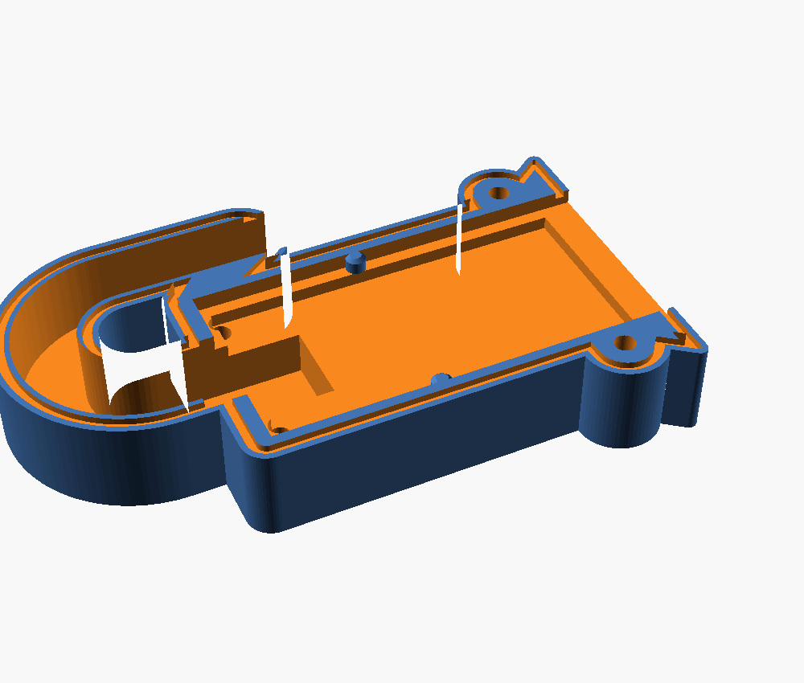

Les sondes vivront dehors. Leur électronique n'est pas protégée. Ce travail de
conception produit un boîtier imprimable en 3D — paramétrique, versionné dans
`hardware/coque/`.

```console
$ just coque-stl        # génère les deux coquilles
$ just coque-test       # banc d'essai des ergots
$ just coque-preview    # ouvre le modèle
```

:::caution[La v4 a été imprimée, la carte n'entrait pas]
La pièce sort propre, mais `enc_y` — la position des ergots le long de la carte
— était estimée à 34 mm alors qu'elle vaut **19 mm**. Les ergots tombaient
15 mm trop bas, la carte reposait dessus au lieu de s'asseoir dedans.

La cote est maintenant relevée, et la v5 la corrige. Voir [le relevé qui
a tranché](#le-relevé-qui-a-tranché).
:::

## La contrainte qui gouverne tout le reste

**Il ne faut surtout pas enfermer la sonde entière.**

La partie basse est l'**électrode capacitive** : la mesure se fait à travers le
vernis du PCB. Ajouter 2 mm de plastique et une lame d'air ferait chuter la
sensibilité à presque rien — on obtiendrait une sonde parfaitement protégée et
parfaitement aveugle.

```text
     ┌─────────┐
     │ NE555   │  ← partie haute : régulateur, connecteur
     │ régul.  │     C'est CE qui tombe en panne dehors,
     │ PH2.0   │     et c'est ce que la coque protège
     ├─────────┤       ← la coque s'arrête ici (45 mm)
     │         │
     │ ÉLECTRODE│  ← surtout pas de plastique par-dessus
     │         │
     ╰────╮╭───╯
          ││
```

La coque couvre donc les **45 mm du haut**, et rien d'autre.

## Le cheminement de la conception

L'intérêt de cette section n'est pas historique : chaque version a été corrigée
sur un défaut précis, et connaître ces défauts évite de les réintroduire.

### v1 — capuchon enfilé par la pointe

Un capuchon qui remonte couvrir la partie haute, avec une jupe évasée pour que
l'eau ruisselant sur les flancs goutte à l'écart du PCB, et un col en haut pour
noyer la sortie de câble dans du silicone.

**Deux défauts rédhibitoires**, relevés à la relecture :

1. **La sortie de câble était verticale.** C'est logique — c'est ce que fait la
   sonde — mais c'est un entonnoir. L'eau ne tombe pas seulement dedans : elle
   descend le long de la gaine par capillarité, et le silicone finit toujours
   par se décoller du PVC du câble à force de cycles chaud/froid.
2. **Rien ne retenait la sonde.** La pièce tenait par collage et friction : il
   suffisait de tirer sur le capteur pour qu'il sorte.

### v2 → v3 — col de cygne et coquilles vissées

**Le col de cygne** répond au premier défaut. Le câble monte, fait une boucle de
180° (rayon 10 mm, largement suffisant pour un câble souple 3 fils), et la
bouche débouche **vers le bas**. Le point haut du conduit est 26 mm plus haut
que la bouche : pour entrer, l'eau devrait remonter.

```text
        ╭──╮
        │  │   point haut
   ╭────╯  ╰────╮
   │             │
   │       bouche ▼  ← 40 mm au-dessus du bas de la coque
 ┌─┴─────────────┐
 │     coque     │
```

Le conduit est moulé dans le plan de joint : le câble se **couche** dedans, il
n'y a rien à enfiler. Le connecteur PH2.0 reste à l'intérieur du boîtier.

**Les deux coquilles vissées** répondent au second : 4 vis M3×12 inox, plus un
épaulement passant sous le corps du connecteur PH2.0. Le connecteur étant soudé
au PCB, tirer sur le capteur le fait buter contre cette marche.

Le joint n'est plus de la colle mais un **cordon de silicone neutre dans une
gorge** usinée sur le plan de joint : il est contenu, il ne s'écrase pas hors du
joint au vissage.

### v4 — les ergots dans les encoches

La sonde possède **deux encoches latérales**, au niveau des derniers composants.
C'est le point d'ancrage idéal : prévu pour ça, symétrique, et surtout **bas**
dans le boîtier — l'effort passe donc près du joint plutôt qu'en porte-à-faux
sur les soudures du connecteur.

Deux ergots dans les parois latérales du logement viennent s'y loger. Ils font
toute l'épaisseur de la carte : une fois la coquille arrière vissée, la carte
est prise dans une **mortaise**.

Vérifié par test d'interférence sur le modèle, avec une carte factice
reproduisant les encoches :

| Position | Résultat |
|---|---|
| Nominale | aucun contact, la carte se pose librement |
| Tirée vers le bas de 1,5 mm | blocage sur les ergots |
| Poussée vers le haut de 1,5 mm | blocage sur les ergots |

L'épaulement sous le connecteur est conservé en **second niveau**, avec 0,8 mm
de jeu : ce sont les encoches qui travaillent, le connecteur ne prend l'effort
que si un ergot casse. Les deux butées bloquant dans le même sens et chacune
ayant son jeu, il n'y a pas de risque de sur-contrainte.

Les ergots sont **volontairement sous-dimensionnés** : 0,3 mm moins profonds
que l'encoche, 0,6 mm plus courts.

**C'est cette version qui a été imprimée.** Elle sort propre, elle se ferme,
et la carte n'entre pas.


### v5 — la cote relevée, et l'ergot rond

Deux corrections, l'une de position, l'autre de forme.

**La position.** `enc_y` passe de 34,0 à **19,4 mm**. C'est le seul défaut qui
empêchait l'encastrement, et c'était le bon soupçon : la v4 posait les ergots
15 mm trop bas, la carte s'appuyait dessus.

**La forme.** L'encoche n'est pas un rectangle mais un **demi-cercle** de
3,55 mm de diamètre. L'ergot rectangulaire de la v4 (3,4 × 1,2 mm) n'y serait
pas entré de toute façon : à 1,7 mm du centre, l'arc ne creuse plus que 0,6 mm,
et les coins de l'ergot auraient buté dessus.

```text
        encoche ⌀3,55            ergot ⌀2,4
   ────────╮      ╭───────    ────────╮  ╭───────
           ╰──────╯                   ╰──╯
   la v4 y mettait un rectangle 3,4 × 1,2 :
   ────────╮ ┌────┐ ╭───────   les coins portent
           ╰─┴────┴─╯          sur l'arc, ça bloque
```

L'ergot est donc un **cylindre**, centré sur le chant de la carte, et
**délibérément plus petit que l'encoche** : cette différence de rayon —
1,775 − 1,2 = **0,575 mm** — *est* la tolérance de montage sur `enc_y`. Un
ergot au diamètre exact n'entrerait qu'à la cote parfaite. Celui-ci accepte
un demi-millimètre d'erreur, et le débattement vertical qu'il concède reste
sous le jeu de 0,8 mm de l'épaulement, qui prend le relais.

Un petit cône en tête sert de guide à la pose.



**Vérifié par banc d'essai**, `just coque-test`, qui intersecte les ergots avec
une carte factice percée de ses encoches :

```console
$ just coque-test
  ok    décalage     0 mm : libre
  ok    décalage   0.5 mm : libre
  ok    décalage  -0.5 mm : libre
  ok    décalage   0.6 mm : bute
  ok    décalage  -0.6 mm : bute
  ok    décalage   1.5 mm : bute
  ok    décalage  -1.5 mm : bute
ergots OK
```

La bascule tombe exactement sur les 0,575 mm calculés. C'est ce test qui
aurait dû tourner avant la première impression : le modèle se rendait, il
n'était pas pour autant montable.

## Le relevé qui a tranché

La sonde photographiée **à côté d'un réglet**, dans le même plan qu'elle : le
réglet est gradué au demi-millimètre, ce qui donne un étalon à ~20,3 pixels par
millimètre dans la zone utile, et une mesure qui ne dépend plus d'un objet posé
plus loin.


| Repère | Distance au bord haut du PCB |
|---|---|
| Début de l'encoche, côté connecteur | 17,2 mm *(lecture directe au réglet : 18)* |
| Fin de l'encoche | 20,7 mm |
| **Centre de l'encoche → `enc_y`** | **18,9 mm** *(le modèle disait 34,0)* |
| Diamètre de l'encoche | 3,55 mm |
| Largeur du PCB → `pcb_w` | 22,6 mm, soit 23,0 nominal **confirmé** |
| Trait blanc de sérigraphie | 24,7 mm |

Les deux relevés indépendants de `enc_y` — 18,95 par la photo, 19,8 en partant
de la lecture directe — s'écartent de 0,85 mm. **La valeur retenue, 19,4, est à
moins de 0,45 mm de chacun**, donc dans la tolérance de 0,575 mm de l'ergot :
les deux hypothèses passent, il n'y a pas à arbitrer entre elles pour imprimer.

:::note[La question du `pcb_in` est tranchée]
On se demandait si ces encoches marquaient la **profondeur d'enfoncement
maximale** — auquel cas la coque aurait dû s'arrêter pile dessus. À 19 mm du
bord haut, c'est exclu : ce serait enterrer la carte jusqu'au connecteur. Le
candidat sérieux est le trait blanc à 24,7 mm, qui reste lui aussi bien
au-dessus du bas de la coque. **`pcb_in` garde ses 48 mm.**
:::

## Les cotes restantes

À confirmer au pied à coulisse, puis à reporter en tête de
`hardware/coque/coque.scad`. Aucune n'est bloquante : ce sont des jeux, plus des
positions.

| Variable | Ce que c'est | Valeur actuelle | Statut |
|---|---|---|---|
| `enc_y` | bord haut du PCB → centre des encoches | 19,4 mm | ✅ relevé |
| `pcb_w` | largeur du PCB | 23,0 mm | ✅ confirmé |
| `enc_diam` | diamètre de l'encoche demi-circulaire | 3,55 mm | mesuré sur photo |
| `pcb_t` | épaisseur du PCB | 1,6 mm | à confirmer |
| `conn_l` | longueur du connecteur le long du PCB | 8,7 mm | standard PH2.0-3P |
| `conn_dh` | bord haut du PCB → haut du connecteur | 0 mm | à confirmer |
| `conn_h` | hauteur du connecteur au-dessus du PCB | 5,75 mm | à confirmer |

**Deux échappatoires** si le montage résiste encore :

- `encoches = false` redonne la v3, sans verrouillage par ergots ;
- `butee = false` renonce à l'épaulement si le connecteur n'est pas orienté
  comme prévu. Le PCB a peut-être un trou de fixation Ø3,4 : s'il existe, un
  téton dedans serait un blocage encore plus franc.

## Impression et montage

**Impression.** Chaque coquille à plat, face extérieure sur le plateau, **zéro
support** — toute la géométrie, col de cygne compris, est une extrusion d'un
profil 2D. Trois périmètres.

**Matière : PETG ou ASA. Pas de PLA**, il se délite en extérieur au bout d'une
saison.

**Montage :**

1. cordon de silicone **neutre** dans la gorge du plan de joint ;
2. PCB posé dans la coquille avant, encoches en face des ergots ;
3. câble couché dans le col de cygne, connecteur PH2.0 à l'intérieur ;
4. 4 vis M3×12 inox ;
5. **boucle d'égouttage** sur le câble sous la sortie, pour que l'eau ne
   descende pas le long du fil.

:::caution[Silicone neutre, jamais acétique]
Le silicone acétique — celui qui sent le vinaigre, le moins cher, le plus
courant en grande surface — dégage de l'acide acétique en réticulant et
**corrode le cuivre**. Sur une carte électronique, c'est une destruction lente
et garantie.
:::

## La limite honnête

C'est une coque étanche **aux projections et à la pluie**, pas un IP68
immersible.

Et surtout : le vrai talon d'Achille de ces cartes n'est pas le boîtier, ce sont
les **tranches nues du PCB**, qui pompent l'humidité par capillarité jusqu'à
l'électronique.

**Le vernissage est donc indispensable, pas optionnel** : deux fines couches de
vernis PCB, de résine époxy ou de vernis à ongles transparent sur l'électrode et
en insistant sur les chants coupés. Une fine couche ne dégrade quasiment pas la
mesure — contrairement à une coque, ce qui est précisément la raison pour
laquelle la coque s'arrête à 45 mm.

Sans vernis, la coque ne fait que retarder l'échéance.

## Ce que ça change pour la stratégie sondes

Ce travail ouvre une option qui n'existait pas quand
[les risques](/materiel/risques/#les-sondes-génériques-ne-sont-pas-vraiment-étanches)
ont été rédigés :

| Voie | Coût | Ce qu'on sait |
|---|---|---|
| Sondes génériques + coque + vernis | ~2 €/sonde + impression | Toute la conception est faite ; les sondes sont déjà là |
| Sondes étanches du commerce (SEN0308, IP65) | ~18 €/sonde | Mal distribuées en France, Farnell annonce septembre 2026 |

La première voie devient crédible. Elle reste à valider **par la durée** — une
sonde vernie et encoquée qui tient un hiver vaut mieux qu'une promesse IP65. La
décision n'est pas à prendre maintenant : elle se prendra à
[O7](/objectifs/o7-mise-au-jardin/), à la lumière du comportement réel des
sondes du POC.
