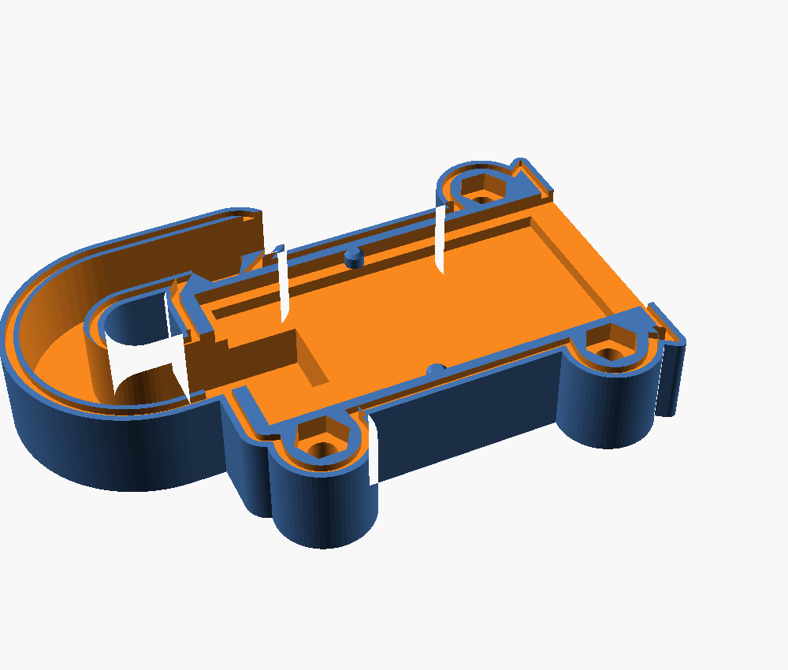
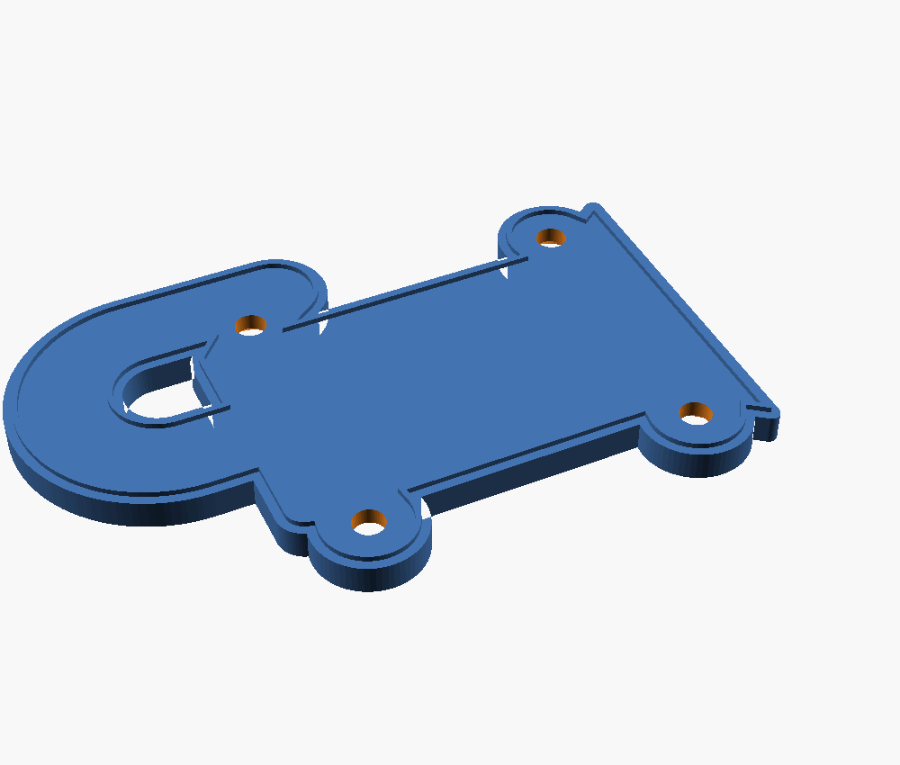

Les sondes vivront dehors. Leur électronique n'est pas protégée. Ce travail de
conception produit un boîtier imprimable en 3D — paramétrique, versionné dans
`hardware/coque/`.

```console
$ just coque-stl        # génère les deux coquilles
$ just coque-test       # banc d'essai des ergots
$ just coque-preview    # ouvre le modèle
```

:::note[Où en est la pièce]
La **v4** a été imprimée : elle sortait propre, la carte n'entrait pas — `enc_y`
était estimée à 34 mm alors qu'elle vaut **20**. La **v5** a corrigé la cote, a
été imprimée à son tour, et **la carte s'encastre**.

Le montage sur table a alors montré ce que la coque ratait une fois fermée :
pas de languette sur la coquille arrière, pas de logement d'écrou ni de tête de
vis, deux vis passant dans la carte et quatre perçages traversant la coque de
part en part. C'est ce que reprend la **v6**, qui reste à imprimer — voir
[fermer la coque](#v6--fermer-la-coque).
:::

## La contrainte qui gouverne tout le reste

**Il ne faut surtout pas enfermer la sonde entière.**

La partie basse est l'**électrode capacitive** : la mesure se fait à travers le
vernis du PCB. Ajouter 2 mm de plastique et une lame d'air ferait chuter la
sensibilité à presque rien — on obtiendrait une sonde parfaitement protégée et
parfaitement aveugle.

```text
     ┌─────────┐
     │ NE555   │  ← partie haute : régulateur, connecteur
     │ régul.  │     C'est CE qui tombe en panne dehors,
     │ PH2.0   │     et c'est ce que la coque protège
     ├─────────┤       ← la coque s'arrête ici (45 mm)
     │         │
     │ ÉLECTRODE│  ← surtout pas de plastique par-dessus
     │         │
     ╰────╮╭───╯
          ││
```

La coque couvre donc les **45 mm du haut**, et rien d'autre.

## Le cheminement de la conception

L'intérêt de cette section n'est pas historique : chaque version a été corrigée
sur un défaut précis, et connaître ces défauts évite de les réintroduire.

### v1 — capuchon enfilé par la pointe

Un capuchon qui remonte couvrir la partie haute, avec une jupe évasée pour que
l'eau ruisselant sur les flancs goutte à l'écart du PCB, et un col en haut pour
noyer la sortie de câble dans du silicone.

**Deux défauts rédhibitoires**, relevés à la relecture :

1. **La sortie de câble était verticale.** C'est logique — c'est ce que fait la
   sonde — mais c'est un entonnoir. L'eau ne tombe pas seulement dedans : elle
   descend le long de la gaine par capillarité, et le silicone finit toujours
   par se décoller du PVC du câble à force de cycles chaud/froid.
2. **Rien ne retenait la sonde.** La pièce tenait par collage et friction : il
   suffisait de tirer sur le capteur pour qu'il sorte.

### v2 → v3 — col de cygne et coquilles vissées

**Le col de cygne** répond au premier défaut. Le câble monte, fait une boucle de
180° (rayon 10 mm, largement suffisant pour un câble souple 3 fils), et la
bouche débouche **vers le bas**. Le point haut du conduit est 26 mm plus haut
que la bouche : pour entrer, l'eau devrait remonter.

```text
        ╭──╮
        │  │   point haut
   ╭────╯  ╰────╮
   │             │
   │       bouche ▼  ← 40 mm au-dessus du bas de la coque
 ┌─┴─────────────┐
 │     coque     │
```

Le conduit est moulé dans le plan de joint : le câble se **couche** dedans, il
n'y a rien à enfiler. Le connecteur PH2.0 reste à l'intérieur du boîtier.

**Les deux coquilles vissées** répondent au second : 4 vis M3×12 inox, plus un
épaulement passant sous le corps du connecteur PH2.0. Le connecteur étant soudé
au PCB, tirer sur le capteur le fait buter contre cette marche.

Le joint n'est plus de la colle mais un **cordon de silicone neutre dans une
gorge** usinée sur le plan de joint : il est contenu, il ne s'écrase pas hors du
joint au vissage.

### v4 — les ergots dans les encoches

La sonde possède **deux encoches latérales**, au niveau des derniers composants.
C'est le point d'ancrage idéal : prévu pour ça, symétrique, et surtout **bas**
dans le boîtier — l'effort passe donc près du joint plutôt qu'en porte-à-faux
sur les soudures du connecteur.

Deux ergots dans les parois latérales du logement viennent s'y loger. Ils font
toute l'épaisseur de la carte : une fois la coquille arrière vissée, la carte
est prise dans une **mortaise**.

Vérifié par test d'interférence sur le modèle, avec une carte factice
reproduisant les encoches :

| Position | Résultat |
|---|---|
| Nominale | aucun contact, la carte se pose librement |
| Tirée vers le bas de 1,5 mm | blocage sur les ergots |
| Poussée vers le haut de 1,5 mm | blocage sur les ergots |

L'épaulement sous le connecteur est conservé en **second niveau**, avec 0,8 mm
de jeu : ce sont les encoches qui travaillent, le connecteur ne prend l'effort
que si un ergot casse. Les deux butées bloquant dans le même sens et chacune
ayant son jeu, il n'y a pas de risque de sur-contrainte.

Les ergots sont **volontairement sous-dimensionnés** : 0,3 mm moins profonds
que l'encoche, 0,6 mm plus courts.

**C'est cette version qui a été imprimée.** Elle sort propre, elle se ferme,
et la carte n'entre pas.


### v5 — la cote relevée, et l'ergot rond

Deux corrections, l'une de position, l'autre de forme.

**La position.** `enc_y` passe de 34,0 à **20,0 mm**. C'est le seul défaut qui
empêchait l'encastrement, et c'était le bon soupçon : la v4 posait les ergots
14 mm trop bas, la carte s'appuyait dessus.

**La forme.** L'encoche n'est pas un rectangle mais un **demi-cercle de
⌀4 mm**. L'ergot rectangulaire de la v4 (3,4 × 1,2 mm) n'y serait pas entré de
toute façon : à 1,7 mm du centre, l'arc ne creuse plus que 1,05 mm, et les
coins de l'ergot auraient buté dessus.

```text
        encoche ⌀4,0             ergot ⌀2,4
   ────────╮      ╭───────    ────────╮  ╭───────
           ╰──────╯                   ╰──╯
   la v4 y mettait un rectangle 3,4 × 1,2 :
   ────────╮ ┌────┐ ╭───────   les coins portent
           ╰─┴────┴─╯          sur l'arc, ça bloque
```

L'ergot est donc un **cylindre**, centré sur le chant de la carte, et
**délibérément plus petit que l'encoche**. Pour deux raisons, pas une :

- la différence de rayon — 2,0 − 1,2 = **0,8 mm** — *est* la tolérance de
  montage sur `enc_y`. Un ergot au diamètre exact n'entrerait qu'à la cote
  parfaite, ce qui est précisément le piège où la v4 est tombée ;
- **un petit cylindre sort toujours surdimensionné de l'imprimante.** Largeur
  d'extrusion et pied d'éléphant ajoutent 0,1 à 0,2 mm au rayon : le ⌀2,4
  modélisé fera plutôt 2,5 à 2,8 une fois posé sur le plateau. Viser le
  diamètre nominal de l'encoche, c'est se garantir un ergot trop gros.

Le débattement vertical concédé reste sous le jeu de 0,8 mm de l'épaulement,
qui prend le relais.

Un petit cône en tête sert de guide à la pose.

**Vérifié par banc d'essai**, `just coque-test`, qui intersecte les ergots avec
une carte factice percée de ses encoches :

```console
$ just coque-test
  ok    décalage     0 mm : libre
  ok    décalage   0.7 mm : libre
  ok    décalage  -0.7 mm : libre
  ok    décalage   0.9 mm : bute
  ok    décalage  -0.9 mm : bute
  ok    décalage   1.5 mm : bute
  ok    décalage  -1.5 mm : bute
ergots OK
```

La bascule tombe exactement sur les 0,8 mm calculés. C'est ce test qui
aurait dû tourner avant la première impression : le modèle se rendait, il
n'était pas pour autant montable.

**Et la v5 a été imprimée : la carte s'encastre.**


Et avec le câble branché, le col de cygne fait ce qu'on lui demandait depuis la
v2 : le connecteur reste à l'intérieur, le câble se couche dans le conduit sans
rien à enfiler, et il ressort par le bas.


### v6 — fermer la coque

L'encastrement réglé, le montage de la v5 sur la table montre trois défauts
qui ne se voyaient pas tant que la carte n'entrait pas.

**La coquille arrière était un couvercle plat.** L'avant portait une gorge à
silicone, l'arrière rien : les deux pièces ne s'emboîtaient pas, elles se
posaient l'une sur l'autre. La v6 met une **languette** sur l'arrière, qui
entre dans la **rainure** de l'avant.

```text
   coquille arrière        ██  languette 0,6 × 0,6
   ───────────────────────█  █──────────────────
   ═══════════════════════╡  ╞══════════════════  plan de joint
   ───────────────────╮  ╭─╮  ╭─╮  ╭─────────────
   coquille avant     ╰──╯ ╰──╯ ╰──╯  rainure 1,0 × 0,9
                        ↑         ↑
                   0,2 de jeu par côté, 0,3 de fond :
                   c'est là que le silicone se loge,
                   contenu de trois côtés au lieu
                   d'être écrasé entre deux plats.
```

**Les vis n'avaient ni logement de tête ni logement d'écrou.** La v6 noie un
**écrou M3 dans un logement hexagonal borgne** creusé dans le plan de joint de
la coquille avant, et **fraise la tête de vis** dans la coquille arrière. La
visserie passe en **M3×8 à tête fraisée**.

L'épaisseur de la coquille arrière passe de 2,4 à **3,2 mm** au passage : une
fraisure à 90° mange déjà 1,4 mm, et il faut de la matière dessous.

**Et surtout, les perçages ne traversent plus.** C'est le défaut que personne
ne cherchait :

:::danger[Les quatre avant-trous de la v5 perçaient la coque de part en part]
Ils allaient de z = −1 à 12,4 pour 11,4 mm d'épaisseur, et débouchaient sur la
face **extérieure**, *à l'intérieur* du cordon de joint. Quatre canaux qui
menaient l'eau droit dans le volume qu'on cherchait à étancher — dans une pièce
dont c'est l'unique raison d'exister.

Le logement d'écrou est **borgne** : hexagone sur 2,6 mm, dégagement de 4 mm
pour la pointe de vis, et 4,8 mm de matière pleine en dessous. Plus rien ne
relie l'extérieur à l'intérieur.
:::

**Enfin, deux vis passaient dans la carte.** Elles étaient à x = ±9, y = 46,5 ;
la carte fait 23 de large et monte à y = 48. Sur la photo ci-dessus on ne voit
que deux trous de vis — les deux autres sont sous la carte. Les vis du haut
passent donc sur des oreilles comme celles du bas, et les oreilles grandissent
de 10 à 12 mm parce qu'un logement d'écrou tient plus de place qu'un avant-trou
et doit rester en dedans de la rainure.





**Le banc d'essai gagne trois contrôles**, un par défaut :

```console
$ just coque-test
ergots contre la carte
  ok    décalage 0 mm                                  libre
  …
le reste de la coque
  ok    aucune vis ne traverse la carte                libre
  ok    aucune cavité ne débouche dehors               libre
  ok    la languette entre dans la rainure             libre
coque OK
```

:::tip[Un test qui n'a jamais échoué ne prouve rien]
Les trois ont été validés en **réintroduisant le défaut** : vis remises à
x = ±9, dégagement d'écrou allongé jusqu'à percer, languette élargie au-delà de
la rainure. Chaque fois le contrôle passe au rouge. Un contrôle qu'on n'a jamais
vu échouer peut très bien ne rien mesurer du tout.
:::

## Le relevé qui a tranché

La sonde est photographiée **posée sur un réglet**, dans son plan. Mesurer les
pixels contre les graduations semble alors suffire — et donne une échelle
**fausse de 5 %**.


La carte est plus haut dans le cadre que les graduations qui servent d'étalon,
donc plus loin de l'objectif, donc reproduite plus petite. Ça s'est vu à un
détail : l'écart avec les lectures directes au réglet **grandissait avec la
distance** — 0,8 mm sur l'encoche, 1,3 mm sur le trait blanc. Un décalage
proportionnel est une erreur d'échelle ; une erreur de lecture aurait été
constante.

### Ne mesurer que des rapports

Le coin haut de la carte, l'encoche et le trait blanc de sérigraphie sont
**alignés sur le même chant**. Quelle que soit l'échelle à cet endroit de
l'image, elle leur est commune — et se simplifie dans un rapport. Il ne reste
qu'à fournir **un** étalon absolu, et une lecture directe au réglet le donne :
le trait blanc est à 26 mm du bord haut.

```text
   coin haut ─┐          ┌─ encoche ─┐              ┌─ trait blanc
              ▼          ▼           ▼              ▼
   ═══════════╤══════════╤═══════════╤══════════════╤═════════
              │◄─ 18,0 ─►│           │              │
              │◄──── 20,0 (enc_y) ──►│              │
              │◄──────────── 26,0 mm, lu au réglet ►│
```

| Repère | Distance au bord haut du PCB |
|---|---|
| Début de l'encoche, côté connecteur | 18,0 mm |
| **Centre de l'encoche → `enc_y`** | **20,0 mm** *(le modèle disait 34,0)* |
| Fin de l'encoche | 22,0 mm |
| Diamètre de l'encoche | 4,0 mm *(mesuré)* |
| Trait blanc de sérigraphie *(étalon)* | 26,0 mm |
| Largeur du PCB → `pcb_w` | 23,0 mm **confirmé** |

**Deux cadrages indépendants** donnent le même résultat à 0,1 mm près — la
`o1-10` ci-dessus et la `o1-14`, prise plus serrée. Et le « début » ainsi
*calculé* retombe sur les 18,0 mm *lus* au réglet, alors que rien dans le
calcul ne l'y forçait : c'est ce qui permet de faire confiance au reste.


### Où le rapport se trompe quand même

Le même calcul donnait **3,77 mm** pour le diamètre de l'encoche, là où la
mesure directe dit **4,0**. Ce n'est pas une contradiction, c'est une limite de
la méthode, et elle a une forme précise.

Le flou de bord coûte environ deux pixels à chaque extrémité d'un repère. Sur
les 500 pixels qui séparent le coin haut du trait blanc, ça fait 0,8 % —
invisible. Sur les 73 pixels de l'encoche, ça fait **5,5 %** — soit exactement
l'écart constaté.

:::tip[La règle qui en sort]
Un rapport mesuré sur une image mesure les **longs écarts**, jamais les petits
détails. Le grand écart calibre, le petit détail se mesure à la main.
:::

:::note[Le trait blanc rouvre la question du `pcb_in` — reportée à O7]
Ce trait est la **limite d'immersion** de la carte : en dessous, plus un seul
composant, rien que l'électrode jusqu'à la pointe.

Or la coque engage 48 mm, soit **22 mm sous ce trait**. Elle ne met pas
l'électronique en danger — au contraire, elle protège bien au-delà de ce que la
carte nue tolère. Mais elle **limite l'enfoncement à 50 mm d'électrode dans le
sol** là où la carte en autorise 72 : on ne pousse la sonde que jusqu'à la lèvre
de la coque.

Descendre `pcb_in` à ~30 mm rendrait ces 22 mm, au prix d'une refonte des
proportions (`H`, `vis_pos`, la jupe, le col).

**Décision prise : on n'y touche pas maintenant.** La v5 corrige un seul défaut,
et c'est ce qu'il faut pour savoir s'il est corrigé — changer la hauteur du
boîtier en même temps rendrait le résultat illisible. La profondeur
d'enfoncement est une question de sol, pas de modèle : elle se tranchera à
[O7](/objectifs/o7-mise-au-jardin/#létanchéité), sur des mesures.
:::

## Les cotes restantes

À confirmer au pied à coulisse, puis à reporter en tête de
`hardware/coque/coque.scad`. Aucune n'est bloquante : ce sont des jeux, plus des
positions.

| Variable | Ce que c'est | Valeur actuelle | Statut |
|---|---|---|---|
| `enc_y` | bord haut du PCB → centre des encoches | 20,0 mm | ✅ relevé |
| `pcb_w` | largeur du PCB | 23,0 mm | ✅ confirmé |
| `enc_diam` | diamètre de l'encoche demi-circulaire | 4,0 mm | ✅ mesuré |
| `pcb_t` | épaisseur du PCB | 1,6 mm | à confirmer |
| `conn_l` | longueur du connecteur le long du PCB | 8,7 mm | standard PH2.0-3P |
| `conn_dh` | bord haut du PCB → haut du connecteur | 0 mm | à confirmer |
| `conn_h` | hauteur du connecteur au-dessus du PCB | 5,75 mm | à confirmer |

**Deux échappatoires** si le montage résiste encore :

- `encoches = false` redonne la v3, sans verrouillage par ergots ;
- `butee = false` renonce à l'épaulement si le connecteur n'est pas orienté
  comme prévu. Le PCB a peut-être un trou de fixation Ø3,4 : s'il existe, un
  téton dedans serait un blocage encore plus franc.

## Impression et montage

**Impression.** Chaque coquille à plat, **face extérieure sur le plateau**,
**zéro support**. L'orientation n'est pas indifférente : c'est elle qui rend la
fraisure de la tête de vis imprimable, le trou se resserrant en montant, ce qui
ne fait qu'un surplomb à 45°. Trois périmètres.

**Matière : PETG ou ASA. Pas de PLA**, il se délite en extérieur au bout d'une
saison.

**Quincaillerie :** 4 vis **M3×8 à tête fraisée** inox et 4 **écrous M3** inox.
Pas de M3×12 : la vis ne traverse plus la coquille avant, elle s'arrête dans
l'écrou noyé au plan de joint.

**Montage :**

1. un **écrou M3 pressé** dans chacun des quatre logements hexagonaux de la
   coquille avant ;
2. cordon de silicone **neutre** dans la rainure du plan de joint ;
3. PCB posé dans la coquille avant, encoches en face des ergots ;
4. câble couché dans le col de cygne, connecteur PH2.0 à l'intérieur ;
5. coquille arrière posée, **languette dans la rainure**, puis les 4 vis ;
6. **boucle d'égouttage** sur le câble sous la sortie, pour que l'eau ne
   descende pas le long du fil.

:::caution[Silicone neutre, jamais acétique]
Le silicone acétique — celui qui sent le vinaigre, le moins cher, le plus
courant en grande surface — dégage de l'acide acétique en réticulant et
**corrode le cuivre**. Sur une carte électronique, c'est une destruction lente
et garantie.
:::

## La limite honnête

C'est une coque étanche **aux projections et à la pluie**, pas un IP68
immersible.

Et surtout : le vrai talon d'Achille de ces cartes n'est pas le boîtier, ce sont
les **tranches nues du PCB**, qui pompent l'humidité par capillarité jusqu'à
l'électronique.

**Le vernissage est donc indispensable, pas optionnel** : deux fines couches de
vernis PCB, de résine époxy ou de vernis à ongles transparent sur l'électrode et
en insistant sur les chants coupés. Une fine couche ne dégrade quasiment pas la
mesure — contrairement à une coque, ce qui est précisément la raison pour
laquelle la coque s'arrête à 45 mm.

Sans vernis, la coque ne fait que retarder l'échéance.

## Ce que ça change pour la stratégie sondes

Ce travail ouvre une option qui n'existait pas quand
[les risques](/materiel/risques/#les-sondes-génériques-ne-sont-pas-vraiment-étanches)
ont été rédigés :

| Voie | Coût | Ce qu'on sait |
|---|---|---|
| Sondes génériques + coque + vernis | ~2 €/sonde + impression | Toute la conception est faite ; les sondes sont déjà là |
| Sondes étanches du commerce (SEN0308, IP65) | ~18 €/sonde | Mal distribuées en France, Farnell annonce septembre 2026 |

La première voie devient crédible. Elle reste à valider **par la durée** — une
sonde vernie et encoquée qui tient un hiver vaut mieux qu'une promesse IP65. La
décision n'est pas à prendre maintenant : elle se prendra à
[O7](/objectifs/o7-mise-au-jardin/), à la lumière du comportement réel des
sondes du POC.
