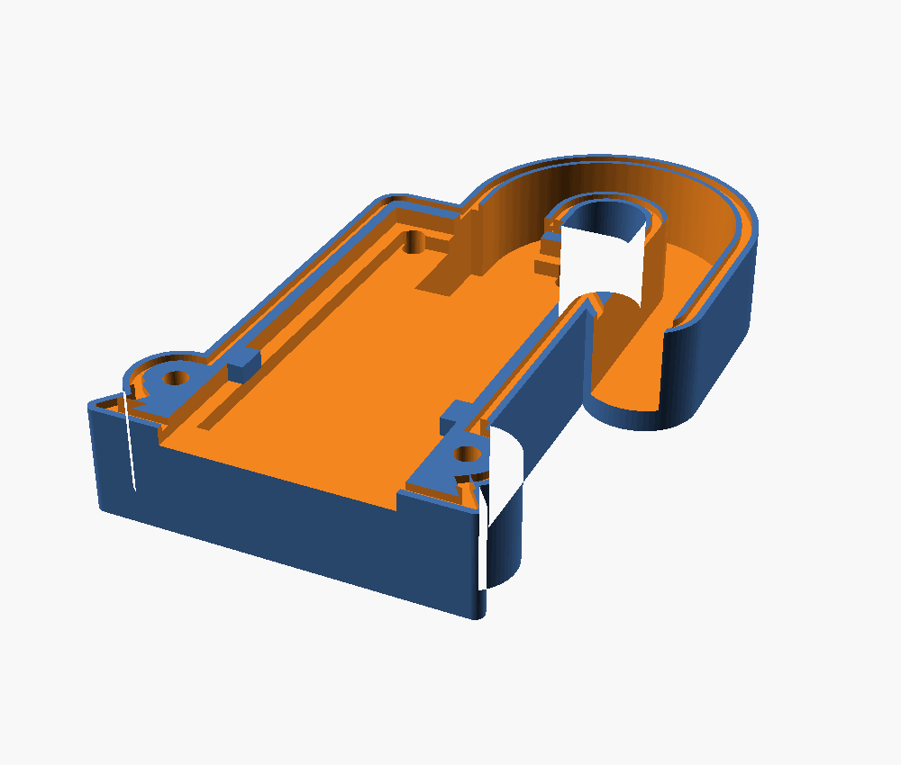

Les sondes vivront dehors. Leur électronique n'est pas protégée. Ce travail de
conception, mené en amont du projet, produit un boîtier imprimable en 3D —
paramétrique, versionné dans `hardware/coque/`.

```console
$ just coque-stl        # génère les deux coquilles
$ just coque-preview    # ouvre le modèle
```

:::danger[Les fichiers ne sont pas prêts à imprimer]
Sept cotes du modèle sont des **estimations**. Il faut les relever au pied à
coulisse sur une sonde réelle — voir [les mesures à
prendre](#les-sept-mesures-à-prendre). Imprimer en l'état produirait une pièce
qui ne se ferme pas.
:::

## La contrainte qui gouverne tout le reste

**Il ne faut surtout pas enfermer la sonde entière.**

La partie basse est l'**électrode capacitive** : la mesure se fait à travers le
vernis du PCB. Ajouter 2 mm de plastique et une lame d'air ferait chuter la
sensibilité à presque rien — on obtiendrait une sonde parfaitement protégée et
parfaitement aveugle.

```text
     ┌─────────┐
     │ NE555   │  ← partie haute : régulateur, connecteur
     │ régul.  │     C'est CE qui tombe en panne dehors,
     │ PH2.0   │     et c'est ce que la coque protège
     ├─────────┤       ← la coque s'arrête ici (45 mm)
     │         │
     │ ÉLECTRODE│  ← surtout pas de plastique par-dessus
     │         │
     ╰────╮╭───╯
          ││
```

La coque couvre donc les **45 mm du haut**, et rien d'autre.

## Le cheminement de la conception

L'intérêt de cette section n'est pas historique : chaque version a été corrigée
sur un défaut précis, et connaître ces défauts évite de les réintroduire.

### v1 — capuchon enfilé par la pointe

Un capuchon qui remonte couvrir la partie haute, avec une jupe évasée pour que
l'eau ruisselant sur les flancs goutte à l'écart du PCB, et un col en haut pour
noyer la sortie de câble dans du silicone.

**Deux défauts rédhibitoires**, relevés à la relecture :

1. **La sortie de câble était verticale.** C'est logique — c'est ce que fait la
   sonde — mais c'est un entonnoir. L'eau ne tombe pas seulement dedans : elle
   descend le long de la gaine par capillarité, et le silicone finit toujours
   par se décoller du PVC du câble à force de cycles chaud/froid.
2. **Rien ne retenait la sonde.** La pièce tenait par collage et friction : il
   suffisait de tirer sur le capteur pour qu'il sorte.

### v2 → v3 — col de cygne et coquilles vissées

**Le col de cygne** répond au premier défaut. Le câble monte, fait une boucle de
180° (rayon 10 mm, largement suffisant pour un câble souple 3 fils), et la
bouche débouche **vers le bas**. Le point haut du conduit est 26 mm plus haut
que la bouche : pour entrer, l'eau devrait remonter.

```text
        ╭──╮
        │  │   point haut
   ╭────╯  ╰────╮
   │             │
   │       bouche ▼  ← 40 mm au-dessus du bas de la coque
 ┌─┴─────────────┐
 │     coque     │
```

Le conduit est moulé dans le plan de joint : le câble se **couche** dedans, il
n'y a rien à enfiler. Le connecteur PH2.0 reste à l'intérieur du boîtier.

**Les deux coquilles vissées** répondent au second : 4 vis M3×12 inox, plus un
épaulement passant sous le corps du connecteur PH2.0. Le connecteur étant soudé
au PCB, tirer sur le capteur le fait buter contre cette marche.

Le joint n'est plus de la colle mais un **cordon de silicone neutre dans une
gorge** usinée sur le plan de joint : il est contenu, il ne s'écrase pas hors du
joint au vissage.

### v4 — les ergots dans les encoches

La sonde possède **deux encoches latérales**, au niveau des derniers composants.
C'est le point d'ancrage idéal : prévu pour ça, symétrique, et surtout **bas**
dans le boîtier — l'effort passe donc près du joint plutôt qu'en porte-à-faux
sur les soudures du connecteur.

Deux ergots dans les parois latérales du logement viennent s'y loger. Ils font
toute l'épaisseur de la carte : une fois la coquille arrière vissée, la carte
est prise dans une **mortaise**.

Vérifié par test d'interférence sur le modèle, avec une carte factice
reproduisant les encoches :

| Position | Résultat |
|---|---|
| Nominale | aucun contact, la carte se pose librement |
| Tirée vers le bas de 1,5 mm | blocage sur les ergots |
| Poussée vers le haut de 1,5 mm | blocage sur les ergots |

L'épaulement sous le connecteur est conservé en **second niveau**, avec 0,8 mm
de jeu : ce sont les encoches qui travaillent, le connecteur ne prend l'effort
que si un ergot casse. Les deux butées bloquant dans le même sens et chacune
ayant son jeu, il n'y a pas de risque de sur-contrainte.

Les ergots sont **volontairement sous-dimensionnés** : 0,3 mm moins profonds
que l'encoche, 0,6 mm plus courts. Si les encoches sont arrondies plutôt que
carrées, un ergot rectangulaire un peu maigre se loge quand même dedans et porte
sur les tangentes.



## Les sept mesures à prendre

À relever au pied à coulisse sur une sonde réelle, puis à reporter en tête de
`hardware/coque/coque.scad`.

| Variable | Ce que c'est | Valeur actuelle | Statut |
|---|---|---|---|
| `pcb_w` | largeur du PCB | 23,0 mm | à confirmer |
| `pcb_t` | épaisseur du PCB | 1,6 mm | à confirmer |
| `conn_l` | longueur du connecteur le long du PCB | 8,7 mm | standard PH2.0-3P |
| `conn_dh` | bord haut du PCB → haut du connecteur | 0 mm | à confirmer |
| `conn_h` | hauteur du connecteur au-dessus du PCB | 5,75 mm | à confirmer |
| **`enc_y`** | **bord haut du PCB → centre des encoches** | **34,0 mm** | ⚠️ **estimé au jugé** |
| `enc_prof` | profondeur de l'encoche dans le chant, par côté | 1,5 mm | ⚠️ estimé |
| `enc_long` | longueur de l'encoche le long de la carte | 4,0 mm | ⚠️ estimé |

:::caution[`enc_y` est la cote qui pardonne le moins]
C'est une position, pas un jeu. Fausse de plus d'un millimètre, la carte ne se
pose pas à plat et la coquille refuse de fermer. Les autres cotes tolèrent
l'approximation ; celle-ci non.
:::

:::danger[La valeur actuelle est probablement fausse de 13 mm]
Mesurée sur la photo `o1-05` en prenant la pièce de 2 € comme étalon, l'encoche
se situe à **19–21 mm** du bord haut du PCB. Le modèle utilise 34 mm.

Cette estimation vaut ce que vaut une photogrammétrie sur photo de téléphone :
la sonde y mesure 111 mm à l'échelle de la pièce alors que ces modules en font
98, soit 13 % d'erreur de perspective, corrigée ici mais pas éliminée. Ce qui
survit à l'incertitude, c'est l'**ordre de grandeur de l'écart** : une douzaine
de millimètres, pas une fraction.

**Ne pas lancer d'impression avant le relevé au pied à coulisse** — photo
`o1-10` de la [liste des photos](/materiel/photos/#o1--une-sonde-une-valeur).
C'est le seul chemin critique encore ouvert du projet.
:::

**Une question à trancher en même temps.** Ces encoches marquent souvent la
**profondeur d'enfoncement maximale conseillée** de la sonde dans le sol. Si
c'est le cas ici, la coque doit s'arrêter pile à ce niveau — il faudrait alors
réduire `pcb_in` (48 mm actuellement) pour que le bas du boîtier tombe juste au
repère, plutôt que 14 mm plus bas. À vérifier en même temps que les mesures.

**Deux échappatoires** si le relevé tourne mal :

- `encoches = false` redonne la v3, sans verrouillage par ergots ;
- `butee = false` renonce à l'épaulement si le connecteur n'est pas orienté
  comme prévu. Le PCB a peut-être un trou de fixation Ø3,4 : s'il existe, un
  téton dedans serait un blocage encore plus franc.

## Impression et montage

**Impression.** Chaque coquille à plat, face extérieure sur le plateau, **zéro
support** — toute la géométrie, col de cygne compris, est une extrusion d'un
profil 2D. Trois périmètres.

**Matière : PETG ou ASA. Pas de PLA**, il se délite en extérieur au bout d'une
saison.

**Montage :**

1. cordon de silicone **neutre** dans la gorge du plan de joint ;
2. PCB posé dans la coquille avant, encoches en face des ergots ;
3. câble couché dans le col de cygne, connecteur PH2.0 à l'intérieur ;
4. 4 vis M3×12 inox ;
5. **boucle d'égouttage** sur le câble sous la sortie, pour que l'eau ne
   descende pas le long du fil.

:::caution[Silicone neutre, jamais acétique]
Le silicone acétique — celui qui sent le vinaigre, le moins cher, le plus
courant en grande surface — dégage de l'acide acétique en réticulant et
**corrode le cuivre**. Sur une carte électronique, c'est une destruction lente
et garantie.
:::

## La limite honnête

C'est une coque étanche **aux projections et à la pluie**, pas un IP68
immersible.

Et surtout : le vrai talon d'Achille de ces cartes n'est pas le boîtier, ce sont
les **tranches nues du PCB**, qui pompent l'humidité par capillarité jusqu'à
l'électronique.

**Le vernissage est donc indispensable, pas optionnel** : deux fines couches de
vernis PCB, de résine époxy ou de vernis à ongles transparent sur l'électrode et
en insistant sur les chants coupés. Une fine couche ne dégrade quasiment pas la
mesure — contrairement à une coque, ce qui est précisément la raison pour
laquelle la coque s'arrête à 45 mm.

Sans vernis, la coque ne fait que retarder l'échéance.

## Ce que ça change pour la stratégie sondes

Ce travail ouvre une option qui n'existait pas quand
[les risques](/materiel/risques/#les-sondes-génériques-ne-sont-pas-vraiment-étanches)
ont été rédigés :

| Voie | Coût | Ce qu'on sait |
|---|---|---|
| Sondes génériques + coque + vernis | ~2 €/sonde + impression | Toute la conception est faite ; les sondes sont déjà là |
| Sondes étanches du commerce (SEN0308, IP65) | ~18 €/sonde | Mal distribuées en France, Farnell annonce septembre 2026 |

La première voie devient crédible. Elle reste à valider **par la durée** — une
sonde vernie et encoquée qui tient un hiver vaut mieux qu'une promesse IP65. La
décision n'est pas à prendre maintenant : elle se prendra à
[O7](/objectifs/o7-mise-au-jardin/), à la lumière du comportement réel des
sondes du POC.
