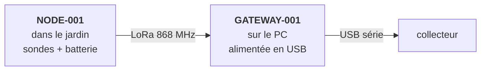

## Commandes passées

Tout a été commandé le **mercredi 12 août 2026**, chez Amazon.fr.

| Produit | Rôle | Qté | Prix unit. | Total | Livraison |
|---|---|---:|---:|---:|---|
| [Heemol SX1262 LoRa V3](https://www.amazon.fr/dp/B0GQSRZCTR) — ESP32-S3 (LX7 dual-core), OLED 0,96", USB-C, 863–928 MHz | `NODE-001` et `GATEWAY-001` | 2 | 26,98 € | 53,96 € | sam. 15 août |
| [DollaTek — 3 sondes capacitives](https://www.amazon.fr/dp/B07L2RV1D2) d'humidité du sol, résistantes à la corrosion | les sondes | 1 lot de 3 | 6,99 € | 6,99 € | sam. 15 août |
| [YOUMILE CD74HC4067](https://www.amazon.fr/dp/B07TXPQ2VM) — multiplexeur analogique/numérique 16 canaux, 2–6 V | multiplexage des sondes | 1 lot de 10 | 11,49 € | 11,49 € | ⚠️ pas de date |
| [BOJACK breadboards](https://www.amazon.fr/dp/B0B18G3V5T) — 2 × 830 points + 2 × 400 points + 126 straps | prototypage | 1 kit | 13,99 € | 13,99 € | sam. 15 août |
| [240 straps Dupont](https://www.amazon.fr/dp/B0BTT48V7P) 10 et 20 cm, M/M et M/F | câblage de prototypage | 1 kit | 10,57 € | 10,57 € | sam. 15 août |
| [INIU 10 000 mAh](https://www.amazon.fr/dp/B08JTQ66K7), 22,5 W, USB-C | alimentation du POC | 1 | 23,59 € | 23,59 € | dim. 16 août |
| | | | **Total** | **120,59 €** | |

:::note[Sur les prix]
Relevés sur les fiches produit le 13 août 2026, au lendemain de la commande. Ce
sont donc les prix affichés, pas nécessairement les montants effectivement
facturés — à corriger depuis la facture si l'écart compte.
:::

Le premier montage est donc possible **à partir du samedi 15 août**, sauf le
multiplexeur.

Pour référence, les ASIN : `B0GQSRZCTR`, `B07L2RV1D2`, `B07TXPQ2VM`,
`B0B18G3V5T`, `B0BTT48V7P`, `B08JTQ66K7`.

## Ce que chaque pièce fait

### Les deux cartes ESP32-S3 + SX1262

C'est le cœur du POC. Une seule carte porte le microcontrôleur, la radio LoRa,
l'USB, l'écran OLED et une gestion de batterie Li-ion — au lieu de :

```text
ESP32 + module LoRa + antenne + alimentation
```

qui fait quatre fois plus de choses à câbler et quatre fois plus de choses
capables de faire perdre une soirée.

Les deux cartes sont **identiques** et jouent des rôles différents :



Ce choix évite d'acheter une vraie passerelle LoRaWAN SX1302/SX1303 à 100 € et
plus, pour un besoin qui est simplement « démontrer que le lien fonctionne ».
Voir [ADR-001](/decisions/#adr-001--lora-point-à-point-plutôt-que-lorawan).

### Les trois sondes capacitives

Capacitives, pas résistives : les sondes résistives se dégradent
électrochimiquement dans le sol en quelques semaines.

Le cahier des charges retenu était :

- capacitif ;
- sortie analogique ;
- alimentation compatible 3,3 V ;
- sortie idéalement 0–3 V ;
- sonde assez longue pour être plantée ;
- électronique protégée.

Ces sondes génériques cochent les cinq premiers points ; le sixième est
douteux — voir [les risques](/materiel/risques/#les-sondes-génériques-ne-sont-pas-vraiment-étanches).

Trois sondes identiques permettent l'expérience la plus intéressante du POC :
les planter **dans le même pot de terre** et comparer.

```text
S1 = 1832
S2 = 1517
S3 = 1798
```

Un écart de cette ampleur entre sondes censées être identiques est une
découverte majeure — et on veut la faire sur une table, pas après avoir enterré
les sondes dans 15 m d'allée.

### Le multiplexeur CD74HC4067

Un ADC, seize entrées analogiques :

```text
              ┌── sonde 1
              ├── sonde 2
ESP32 ── MUX ─┼── sonde 3
              ├── ...
              └── sonde 16
```

Trois entrées seulement seront utilisées au POC. Il est là pour qu'on ne
conçoive pas dès maintenant une architecture qui plafonne à deux ou trois
sondes. Le lot de dix modules est du surplus assumé (c'était le
conditionnement disponible) : il servira aux futurs nœuds.

### La powerbank

Alimentation temporaire, rien de plus :

```text
powerbank ──USB── Heltec
```

Pas de batterie LiFePO₄, pas de panneau, pas de régulateur solaire, pas de
chargeur. Tout ça est le sujet de [O6](/objectifs/o6-autonomie/), et l'ajouter
maintenant introduirait une variable de plus dans un montage qu'on cherche
justement à garder trivial.

:::caution
Cette powerbank va poser un problème précis dès qu'on activera le deep sleep.
Voir [les risques](/materiel/risques/#la-powerbank-va-se-couper-en-deep-sleep).
:::

## Ce qui n'a pas été acheté, volontairement

- ❌ panneau solaire
- ❌ batterie LiFePO₄ et son contrôleur de charge
- ❌ boîtier IP65
- ❌ vraie passerelle LoRaWAN
- ❌ 20 sondes
- ❌ électrovannes
- ❌ PCB sur mesure
- ❌ câble multiconducteur de 15 m

Les straps Dupont ne sont **utilisables que sur la table**. Pour les 15 m de
l'allée, il faudra du vrai câble multiconducteur souple avec des connecteurs
adaptés — mais ce choix dépend de ce qu'on aura appris sur le bruit et la chute
de tension, donc il attend [O7](/objectifs/o7-mise-au-jardin/).

## Ce qu'il manquera probablement

Repéré, non commandé, à décider quand le besoin sera confirmé par une mesure :

| Besoin | Pour quel objectif | Note |
|---|---|---|
| Antenne 868 MHz correcte + câble pigtail | O4 / O7 | Les antennes fournies avec ces cartes sont médiocres |
| Multimètre avec mesure de courant µA | O6 | Indispensable pour caractériser le deep sleep |
| Sondes réellement étanches (type DFRobot SEN0308, IP65) | O7 | Mal distribuées en France : RS ~18 €, Farnell annonce sept. 2026 |
| Câble multiconducteur souple blindé, 20 m | O7 | Section et blindage à choisir selon le bruit mesuré |
| Boîtier IP65 + presse-étoupes | O7 | |
| Batterie LiFePO₄ + panneau + MPPT | O6 | |
| Filament PETG ou ASA | O7 | Pour la [coque des sondes](/materiel/coque-des-sondes/). Pas de PLA |
| Vis M3×12 inox (4 par coque) | O7 | |
| Silicone **neutre** | O7 | Surtout pas acétique : il corrode le cuivre |
| Vernis PCB ou résine époxy | O1 / O7 | À appliquer **avant toute mise en terre**, même pour un test court |
| Pied à coulisse | O1 | Sept cotes de la coque restent à relever |
