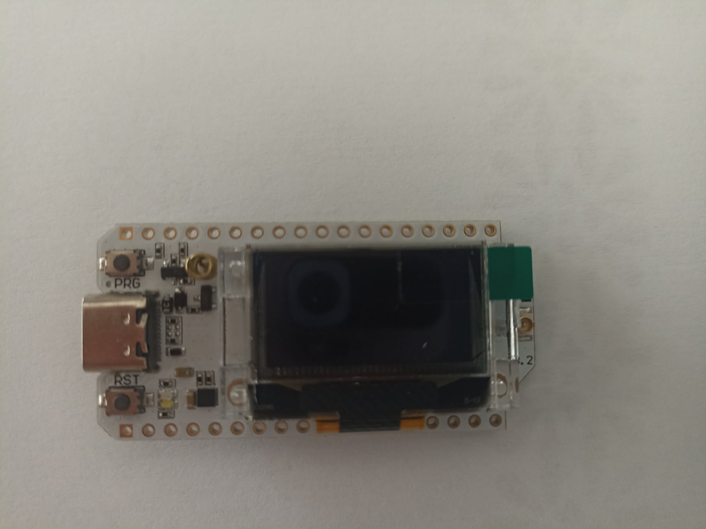

Cette page est une **liste de courses photographiques**. Elle existe parce que
les images génériques trouvées sur internet n'illustrent presque jamais le
matériel qu'on a réellement sous la main : un ESP32 générique n'aide personne à
reconnaître l'antenne d'un clone Heemol, et une sonde résistive de 2014 embrouille
plus qu'elle n'explique.

Coche au fur et à mesure. Une photo ratée mais prise vaut mieux qu'une photo
parfaite jamais faite — le montage sera démonté, et on ne le remontera pas pour
la documentation.

## Conventions

**Où les mettre.** Dans `docs/src/assets/photos/`. Astro les optimise et les
redimensionne automatiquement à la compilation ; inutile de les compresser
avant.

**En quel format.** **JPEG pour les photos, PNG pour les captures d'écran et les
rendus.** Ce n'est pas une préférence esthétique : un PNG stocke chaque pixel
sans perte, ce qui convient au trait net et aux aplats d'une capture, mais coûte
six à dix fois plus cher sur le bruit de capteur d'un appareil photo. La `o1-05`
est passée de 3,8 Mo à 584 Ko sans différence visible, sérigraphie du capteur
comprise.

Git conserve chaque version d'un fichier binaire pour toujours : un PNG déposé
par erreur reste dans l'historique même après correction. Sur la trentaine de
photos que prévoit cette page, l'écart se compte en centaines de mégaoctets.

Si ton appareil sort du PNG ou du HEIC, `imagemagick` est dans le devshell :

```console
$ magick photo.png -quality 90 -strip o1-05-sonde-echelle.jpg
```

`-strip` retire les métadonnées EXIF, qui contiennent la date, le modèle
d'appareil et parfois les coordonnées GPS du lieu de prise de vue.

**Comment les nommer.** `<objectif>-<numéro>-<sujet>.jpg`, en minuscules et
sans accent :

```text
o1-01-carte-deballee.jpg
o1-04-oled-allume.jpg
o3-02-trois-sondes-meme-pot.jpg
```

Le numéro suit l'ordre des étapes de l'objectif, pas l'ordre de prise de vue.

**Comment les insérer** dans une page de `src/content/docs/` :

```markdown

```

Trois `../` depuis `src/content/docs/<section>/` : deux ne suffisent pas et
Astro échoue au build avec `image-not-found`.

:::caution[Renommer ou supprimer une image demande de relancer `just dev`]
Astro tient un cache des images dans `docs/.astro/content-assets.mjs`. Il ne
suit ni les renommages ni les suppressions : le serveur de développement
continue de chercher l'ancien nom et affiche `ImageNotFound`, alors que le
fichier existe sous son nouveau nom — ou n'a plus lieu d'exister — et que
`just build` passe sans broncher.

Le symptôme trompe, parce que l'erreur pointe le **cache** et pas la page. Si
`just build` et `just links` passent, la documentation n'est pas cassée : c'est
le serveur qui est en retard.

Coupe le serveur et relance-le. Si l'erreur résiste, `just clean` vide le cache
et `dist/`.
:::

Le texte alternatif n'est pas décoratif : il décrit ce qu'on doit voir. C'est ce
qui reste quand l'image ne charge pas, et c'est ce que lisent les moteurs de
recherche.

## Cadrage : cinq règles

1. **Lumière du jour, pas de flash.** Le flash crée un reflet blanc au milieu
   du circuit imprimé, exactement là où sont les inscriptions qu'on veut lire.
2. **Un objet de référence** quand l'échelle compte — une pièce de 2 €, un
   stylo. « La sonde fait 10 cm » ne dit rien tant qu'on ne l'a pas vue à côté
   de quelque chose.
3. **De face pour les écrans.** Un OLED photographié de biais est illisible, et
   son contraste s'effondre.
4. **Le câblage vu du dessus**, pas de trois quarts : on doit pouvoir suivre
   chaque fil d'un bout à l'autre.
5. **Une photo, une idée.** Deux montages dans la même image, c'est une image
   qu'on ne peut légender ni pour l'un ni pour l'autre.

## O1 — Une sonde, une valeur

L'atelier le plus important à documenter : c'est celui qu'on refera avec chaque
nouveau capteur.

| # | Photo | Pourquoi |
|---|---|---|
| `o1-01` ✅ | La carte sortie du sachet, à plat, **antenne non montée** | Montrer à quoi ressemble le connecteur d'antenne nu |
| `o1-02` ✅ | Gros plan sur le connecteur u.FL, antenne clipsée | La consigne de sécurité la plus importante du projet mérite une image |
| `o1-03` ✅ | La carte branchée en USB, écran d'usine allumé (`LORA MODE 0`) | L'état « ça vit ». Sur nos cartes la LED reste éteinte au démarrage : c'est l'écran qui fait foi |
| `o1-04` ✅ | L'écran affichant `JARDIN / O1 - ecran OK`, **de face** | La preuve que le brochage du clone est bon |
| `o1-05` ✅ | La sonde entière, avec une pièce de 2 € à côté | L'échelle réelle, et le trait de graduation |
| `o1-06` | Gros plan sur le trait de graduation | La limite d'immersion, qu'on répète partout |
| `o1-07` | Le câblage complet vu du dessus : sonde → breadboard → carte | À comparer avec le schéma dessiné |
| `o1-08` | La sonde dans le verre d'eau, jusqu'au trait | L'expérience de caractérisation |
| `o1-09` | Capture d'écran du moniteur série pendant la mesure | Une capture, pas une photo de l'écran |

:::tip[La 09 est une capture, pas une photo]
Pour tout ce qui est terminal, `Ctrl-Maj-S` (ou l'outil de capture de ton
environnement) donne un résultat net et copiable. Photographier un écran
d'ordinateur donne toujours du moiré.
:::

### Le relevé au pied à coulisse

À faire pendant le même atelier, parce que la sonde est déjà en main : les
[cotes de la coque](/materiel/coque-des-sondes/#les-cotes-restantes) sont
bloquantes pour l'impression.

| # | Photo | Pourquoi |
|---|---|---|
| `o1-10` ✅ | Gros plan sur les **deux encoches latérales**, avec un réglet dans le même plan que la carte | A donné `enc_y` à 20 mm quand le modèle en disait 34 — [le relevé](/materiel/coque-des-sondes/#le-relevé-qui-a-tranché) |
| `o1-11` | Le connecteur PH2.0 vu de côté, réglet ou pied à coulisse dans le cadre | `conn_l`, `conn_dh`, `conn_h` |
| `o1-12` | La sonde à plat sur du papier millimétré | Permet de recontrôler toutes les cotes après coup |
| `o1-13` ✅ | La coque imprimée posée à côté de la sonde, à plat | L'état de la v4, celle qui ne se montait pas |
| `o1-14` ✅ | Le même relevé, **cadrage serré** | Un second cadrage confirme le premier à 0,1 mm : une seule photo ne se contredit jamais toute seule |
| `o1-15` ✅ | La carte **encastrée** dans la coquille avant v5 | La preuve que les ergots tombent en face des encoches. Montre aussi que deux vis manquent à l'appel : elles sont sous la carte |
| `o1-16` ✅ | La même, **câble branché** et couché dans le col de cygne | Le col fait ce qu'on lui demandait depuis la v2 : rien à enfiler, sortie vers le bas |

La `o1-12` est celle qui rattrape les oublis : avec une photo nette sur papier
millimétré, on peut reprendre n'importe quelle mesure sans ressortir la sonde.

:::tip[Photographier un étalon ne suffit pas : il faut une cote lue à la main]
La `o1-05` posait une pièce de 2 € près de la sonde. La `o1-10` met la sonde
**sur** le réglet, ce qui est mieux — mais compter les pixels entre les
graduations donne encore 5 % d'erreur, parce que la carte est plus haut dans le
cadre que les graduations, donc plus loin de l'objectif.

Ce qui a sauvé le relevé, c'est **une seule cote lue directement au réglet**
(26 mm) : elle sert d'étalon absolu, et la photo ne fournit plus que des
rapports entre repères alignés, où l'échelle se simplifie. Détail complet dans
[le relevé de la coque](/materiel/coque-des-sondes/#le-relevé-qui-a-tranché).

En pratique : sur une photo de mesure, **note aussi une cote au réglet dans le
message qui l'accompagne**. Sans elle, la photo ne vaut qu'un ordre de grandeur.
:::

## O2 — Multiplexage

| # | Photo | Pourquoi |
|---|---|---|
| `o2-01` | Le module CD74HC4067 seul, pastilles lisibles | Identifier `S0`–`S3`, `EN`, `SIG` |
| `o2-02` | Le câblage complet avec les trois sondes, du dessus | Le montage qu'on refera à chaque nœud |
| `o2-03` | Gros plan sur les broches d'adresse `S0`–`S3` | C'est là qu'on se trompe |

## O3 — Calibration

L'objectif où les photos servent de **preuve expérimentale**, pas d'illustration.

| # | Photo | Pourquoi |
|---|---|---|
| `o3-01` | Les trois sondes alignées, étiquetées `S1` `S2` `S3` | L'étiquetage compte : sans lui, les mesures ne sont attribuables à rien |
| `o3-02` | Les trois sondes dans le **même pot**, à la même profondeur | Le montage de l'expérience de divergence |
| `o3-03` | Le pot en état « sec » | Comparaison visuelle |
| `o3-04` | Le même pot en état « saturé », juste après ruissellement | Idem |
| `o3-05` | Capture des trois valeurs simultanées | Le résultat, chiffré |

:::note
Pour `o3-03` et `o3-04`, prends les deux photos **avec le même cadrage et la
même lumière**. C'est ce qui les rend comparables. Repère la position du pot au
scotch sur la table.
:::

## O4 — Le lien radio

| # | Photo | Pourquoi |
|---|---|---|
| `o4-01` | Les deux cartes côte à côte, étiquetées `NODE-001` et `GATEWAY-001` | Deux cartes identiques, deux rôles : ça se voit mal sans étiquette |
| `o4-02` | La passerelle branchée en USB sur le poste | Le montage côté maison |
| `o4-03` | **Une photo par point de mesure de portée**, avec le nœud en main et le jardin visible derrière | Ce sont les obstacles qui expliquent les résultats — un RSSI sans contexte visuel ne s'interprète pas |
| `o4-04` | Une vue large du terrain depuis la maison | Pour situer les points de mesure les uns par rapport aux autres |

## O7 — Mise au jardin

| # | Photo | Pourquoi |
|---|---|---|
| `o7-01` | La tranchée ou le passage de câble avant enfouissement | On ne le reverra jamais après |
| `o7-02` | Une sonde en place dans le sol, avant rebouchage | La profondeur réelle, avec un mètre dans le cadre |
| `o7-03` | Le boîtier ouvert, montage terminé | La référence pour toute maintenance future |
| `o7-04` | Le boîtier fermé, en place sur le terrain | L'état nominal |
| `o7-05` | Vue large de l'allée avec les positions repérées | La carte d'implantation |
| `o7-06` ✅ | La [coque](/materiel/coque-des-sondes/) montée, sonde dedans, vue de la **coquille avant** | Cette face n'a aucun perçage : c'est la preuve visible que plus rien ne relie l'extérieur au volume étanche |
| `o7-07` | La coque fermée, câble sorti par le col de cygne | La sortie de câble vers le bas, qui est tout l'intérêt du design |
| `o7-08` | L'électrode vernie, avant et après | Le vernissage est la moitié de la protection |
| `o7-09` ✅ | La coque en main, de profil | L'encombrement réel une fois fermée, et le plan de joint |

:::caution[Photographie avant de reboucher]
`o7-01` et `o7-02` sont les seules photos de cette liste qu'il est **impossible**
de reprendre plus tard. Le jour de l'installation, prends-les avant toute chose.
:::

## Ce qu'on ne prendra pas en photo

Pour éviter d'accumuler des images qui ne servent à rien :

- les écrans d'ordinateur photographiés à l'appareil — capture d'écran ;
- les plans de travail en désordre — on ne voit rien ;
- le matériel encore emballé, sauf `o1-01` qui a une raison précise ;
- les photos « souvenir » sans intention documentaire.

## Sources externes

Peu d'images du web sont à la fois réutilisables et pertinentes. Les diagrammes
de brochage officiels sont sous copyright constructeur : on les **lie** plutôt
que de les recopier.

- [Guide GPIO officiel de la WiFi LoRa 32 V3](https://wiki.heltec.org/docs/devices/open-source-hardware/esp32-series/lora-32/wifi-lora-32-v3/Pin-diagram-guidance)
  — la référence pour `firmware/include/board.h`
- [Fiche produit Heltec WiFi LoRa 32 V3](https://heltec.org/project/wifi-lora-32-v3/)
- [Brochage et caractéristiques, espboards.dev](https://www.espboards.dev/esp32/heltec-wifi-lora-32-v3/)

Sur Wikimedia Commons, sous licence libre, il existe des photos de cartes ESP32
et de sondes d'humidité — mais aucune ne correspond à notre matériel :
[ESP32 Dev Board](https://commons.wikimedia.org/wiki/File:ESP32_Dev_Board.jpg)
est un module WROOM-32 sans écran ni radio LoRa, et
[Soil moisture sensor](https://commons.wikimedia.org/wiki/File:Soil_moisture_sensor.JPG)
montre une sonde professionnelle sans rapport avec nos modules capacitifs à 2 €.
Elles induiraient en erreur plus qu'elles n'aideraient.

D'où le parti pris : **schémas dessinés à la main** pour ce qui est
structurel — comme celui du
[câblage de O1](/objectifs/o1-une-sonde/#étape-5--brancher-la-sonde) — et
**photos maison** pour tout le reste.
