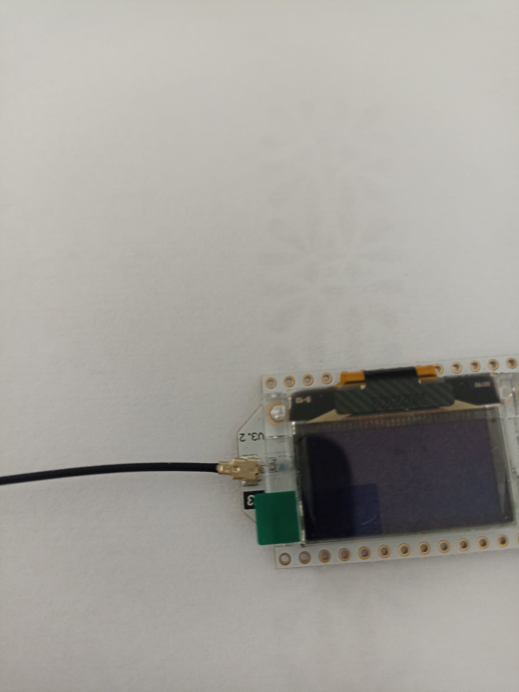
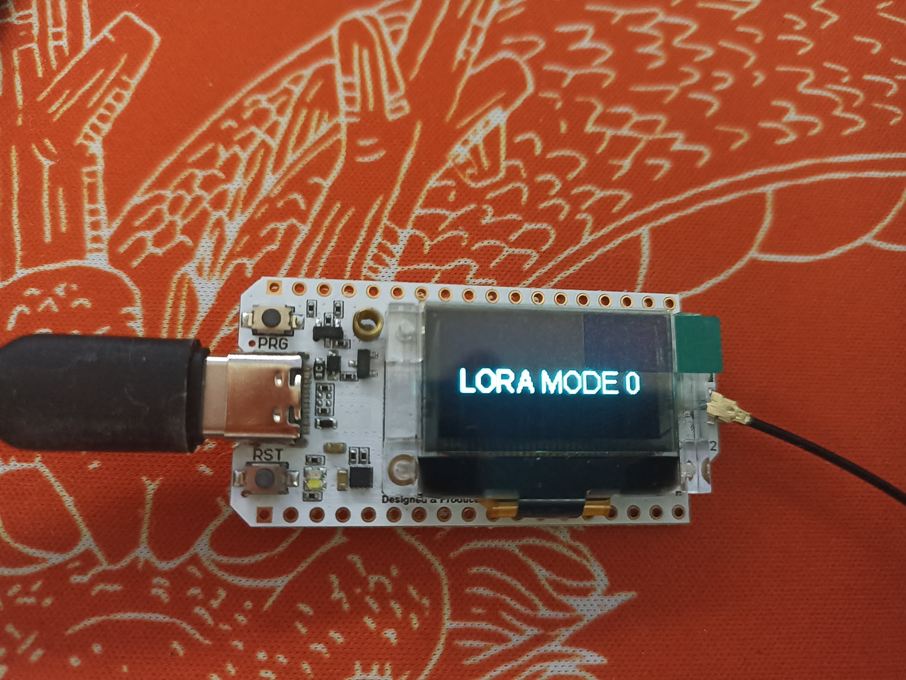
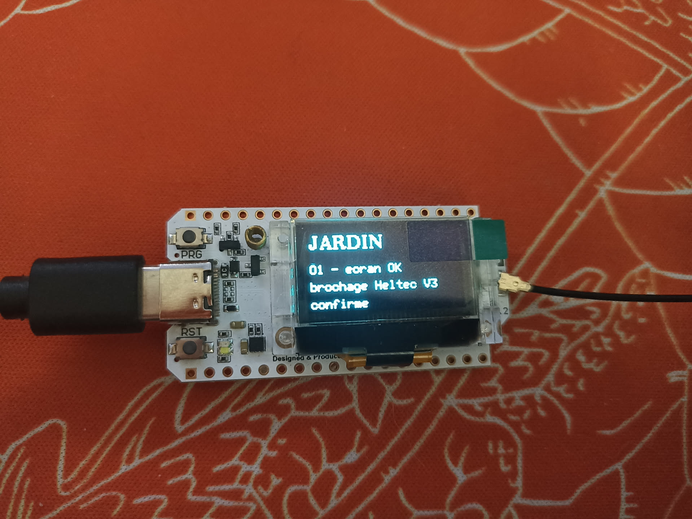
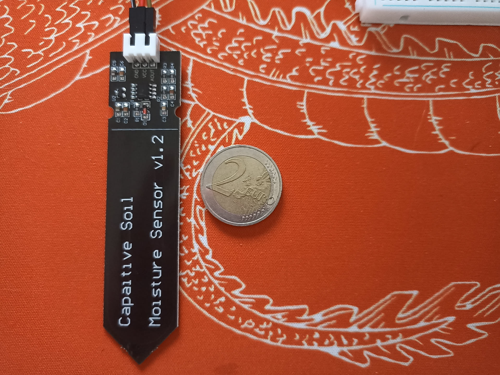

**La question.** Est-ce qu'une sonde donne une valeur stable et plausible ?

**Critère de sortie.** Une sonde branchée sur la carte, un nombre qui défile
sur l'ordinateur, et une variation nette et reproductible entre l'air libre et
un verre d'eau.

**Dépend de.** [O0](/objectifs/o0-socle/) · **Débloque.**
[O2](/objectifs/o2-multiplexage/) et [O4](/objectifs/o4-lien-radio/)

Cette page est un **tutoriel**. Elle se suit dans l'ordre, du sachet non ouvert
jusqu'à la première mesure. Chaque étape a un résultat visible : si tu ne le
vois pas, ne passe pas à la suivante.

## Le vocabulaire, une fois pour toutes

Sept mots reviennent partout. Ils ne sont pas difficiles, ils sont juste
jamais expliqués.

| Mot | Ce que c'est |
|---|---|
| **La carte** | Le rectangle de circuit imprimé, ici le Heemol / Heltec V3. Il porte le microcontrôleur, la radio, un écran et une prise USB. |
| **OLED** | Le petit écran noir de 1,5 cm collé sur la carte, celui qui affiche du texte blanc. OLED est juste la technologie d'affichage. Il n'a aucun rôle dans le projet final — il sert à voir si la carte va bien sans avoir à la brancher à l'ordinateur. |
| **GPIO** | Une des pattes métalliques sur les bords de la carte, numérotée. « GPIO 7 » = la patte n° 7. C'est là qu'on branche les fils. |
| **ADC** | Le circuit qui transforme une tension électrique en nombre. Chez nous : 0 V devient 0, et 3,3 V devient 4095. C'est lui qui « lit » la sonde. |
| **Un croquis** (*sketch*) | Un petit programme qu'on met dans la carte. Elle n'en exécute qu'un seul à la fois, et il redémarre à chaque mise sous tension. |
| **Téléverser** (*flash*) | Envoyer un croquis dans la carte par le câble USB. Ça remplace le précédent. |
| **Le moniteur série** | Une fenêtre de texte sur l'ordinateur, qui affiche ce que la carte raconte par le câble USB. C'est le seul moyen de savoir ce qu'elle fait. |

Un dernier, propre à cette carte : **`Vext`** est la patte qui met l'écran sous
tension. Particularité déroutante, elle est **active à l'état bas** : il faut
lui écrire `LOW` (0) pour *allumer*. C'est courant en électronique, et c'est la
cause n° 1 des « mon écran reste noir ».

## Ce qu'il te faut sur la table

- 1 carte Heemol / Heltec V3 **avec son antenne**
- 1 câble USB-C
- 1 sonde capacitive
- 1 breadboard
- 3 straps Dupont mâle-femelle
- **1 fer à souder et de l'étain**, pour les barrettes de la carte

Le multiplexeur, la deuxième carte et la powerbank ne servent **pas** ici.

:::danger[Les barrettes de la carte sont à souder, et ce n'est pas optionnel]
La carte arrive avec ses rangées de trous **nues** : les barrettes de
connecteurs sont dans la boîte, libres, non soudées. Tant qu'elles n'y sont pas,
la carte ne peut ni s'enficher dans une breadboard, ni recevoir un strap
autrement qu'en le tenant à la main.

Les étapes 1 à 4 — LED, écran, radio — n'ont besoin que de l'USB et se font sans
rien souder. **L'étape 5 ne se fait pas sans.** Un fil simplement posé dans un
trou métallisé donne un contact qui va et vient, et le symptôme est trompeur :
la mesure paraît absurde ou la sonde paraît morte, alors que tout fonctionne.

C'est la panne qui a coûté le plus de temps lors du premier montage. Voir les
[résultats](#résultats).
:::

## Étape 0 — Préparer l'ordinateur

Tu n'as rien à installer à la main : tout est déjà déclaré dans le `flake.nix`.

```console
$ cd ~/Apps/github/gfriloux/jardin
$ nix develop
jardin — devshell. Tâches disponibles : just --list
```

Cette commande te donne **PlatformIO** (qui compile et téléverse les croquis),
`esptool` et `picocom`. Tu peux vérifier :

```console
$ pio --version
PlatformIO Core, version 6.1.19
```

:::caution[Pourquoi `platformio` et pas `platformio-core`]
PlatformIO télécharge lui-même ses compilateurs (`xtensa-esp32s3-elf-g++`),
qui sont des binaires liés dynamiquement pour une distribution classique. Sous
NixOS, ils refusent de démarrer :

```text
Could not start dynamically linked executable: xtensa-esp32s3-elf-g++
NixOS cannot run dynamically linked executables intended for generic
linux environments out of the box.
```

Le flake utilise donc `pkgs.platformio`, qui est un environnement FHS (bwrap)
dans lequel ces binaires fonctionnent, et non `pkgs.platformio-core`. Rien à
faire de ton côté, mais c'est bon à savoir le jour où tu voudras compiler
depuis un autre dossier.
:::

### La seule chose qui demande sudo

C'est la seule modification système du projet. **Faite le 13 août 2026.**

```nix
{
  # Règles d'accès aux cartes de développement
  services.udev.packages = [ pkgs.platformio-core.udev ];

  # Accès aux ports série
  users.users.kuri.extraGroups = [ "dialout" ];
}
```

puis `nixos-rebuild switch`.

Ce que fait réellement la règle installée, pour une carte à puce CP210x comme
la nôtre (`10c4:ea60`) :

```text
ATTRS{idVendor}=="10c4", ATTRS{idProduct}=="ea[67][013]", MODE:="0666",
  ENV{ID_MM_DEVICE_IGNORE}="1", ENV{ID_MM_PORT_IGNORE}="1"
```

Deux effets, et le second est le plus important :

- **`MODE:="0666"`** rend le port accessible à tout le monde. L'appartenance au
  groupe `dialout` n'est donc pas nécessaire pour cette carte — elle reste utile
  comme filet pour du matériel non couvert par les règles, et devient active à
  la prochaine connexion de session.
- **`ID_MM_DEVICE_IGNORE`** interdit à **ModemManager** de sonder le port. Sans
  ça, il l'ouvre au branchement de l'ESP32 et fait échouer un téléversement sur
  deux, avec un message d'erreur qui n'évoque jamais ModemManager. C'est un
  grand classique, et une cause de perte de temps considérable.

:::tip
Le flake réexporte ces règles, si tu préfères les tirer du projet plutôt que
de nixpkgs :

```nix
services.udev.packages = [ inputs.jardin.packages.x86_64-linux.udev-rules ];
```
:::

Contournement à chaud, si jamais un port reste inaccessible :
`sudo chmod 666 /dev/ttyUSB0`. Ça marche, ça ne survit pas au débranchement.

:::note[Un avertissement de PlatformIO à ignorer]
```text
Warning! Please install `99-platformio-udev.rules`.
```

C'est un **faux positif**, et il apparaîtra à chaque téléversement. Le paquet
`platformio` de nixpkgs est un environnement FHS : il remplace `/etc` par un
tmpfs et n'y remonte qu'une liste blanche d'entrées de l'hôte, dont `/etc/udev`
ne fait pas partie. PlatformIO cherche donc le fichier depuis l'intérieur de sa
cage, où il n'existe pas.

Les règles sont bel et bien installées et actives : **udev tourne sur l'hôte**,
pas dans le bac à sable. La preuve qui compte est ailleurs — au branchement, le
port apparaît en `0666`.
:::

## Étape 1 — Sortir la carte et monter l'antenne


:::danger[À faire avant toute mise sous tension]
**Monte l'antenne sur la carte avant de brancher l'USB.**

La puce radio SX1262, si elle émet sans antenne, renvoie sa puissance dans son
propre étage de sortie et se détruit. C'est le moyen le plus rapide de perdre
une carte neuve, et ça vaut même pour un simple test d'écran : tu ne contrôles
pas ce que fait le firmware d'usine au démarrage.

Prends l'habitude sur les deux cartes, tout de suite.
:::

**Le connecteur de la carte se clipse, il ne se visse pas.** C'est une prise
u.FL : le petit connecteur doré au bout du câble noir se pose bien à plat sur
son embase, puis s'enfonce d'un coup d'ongle vertical. Tu sens un clic. Ne
cherche pas de filetage sur la carte, il n'y en a pas — le pas de vis, c'est à
l'autre bout, là où l'antenne se visse sur la queue de cochon.

Appuie droit. De travers, la collerette se déforme et le contact devient
intermittent, ce qui donne plus tard des pertes de portée difficiles à
diagnostiquer.



Branche ensuite le câble USB-C entre la carte et l'ordinateur. Le démarrage est
quasi instantané, et l'écran affiche le firmware d'usine — sur nos cartes,
`LORA MODE 0`.



C'est l'écran, et non une LED, qui fait office de signe de vie : la LED blanche
à côté du bouton `RST` reste éteinte tant qu'un firmware ne la pilote pas. C'est
justement ce que fait l'étape suivante.

:::note[`LORA MODE 0` confirme la consigne de l'antenne]
Ce que cet écran raconte, c'est que le firmware d'usine a **déjà initialisé la
radio** à la mise sous tension, avant que tu aies eu le temps de faire quoi que
ce soit. C'est exactement le scénario décrit plus haut : sans antenne, cette
seule mise sous tension suffisait à mettre la SX1262 en danger.
:::

Vérifie que l'ordinateur voit la carte :

```console
$ just fw-ports
/dev/ttyUSB0
----------
Hardware ID: USB VID:PID=10C4:EA60 SER=0001 LOCATION=3-10
Description: CP2102 USB to UART Bridge Controller
```

Le nom peut être `/dev/ttyUSB0` ou `/dev/ttyACM0`. La puce d'interface de nos
cartes est une **CP2102** de Silicon Labs, gérée nativement par le noyau Linux —
aucun pilote à installer.

:::danger[`/dev/ttyS0` et `/dev/ttyS3` ne sont pas ta carte]
Ce sont les ports série de la **carte mère**. Ils existent toujours, carte
branchée ou non. Sans garde-fou, PlatformIO ne trouve aucun port USB, se rabat
sur eux, et tente d'y téléverser un firmware ESP32 :

```text
Auto-detected: /dev/ttyS0
A fatal error occurred: Could not open /dev/ttyS0, the port is busy or doesn't exist.
Hint: Try to add user into dialout or uucp group.
```

Le message parle de permissions, ce qui envoie chercher au mauvais endroit : le
vrai problème est qu'**il n'y a pas de carte**. C'est pour ça que `just fw`
refuse désormais de démarrer sans port USB, avec un message qui le dit.
:::

:::caution[Si rien n'apparaît : retourne la fiche USB-C]
Notre première carte s'est allumée, a affiché `LORA MODE 0`, et n'est apparue
sur **aucun** port série. Trois câbles différents, plusieurs ports, y compris un
câble dont on savait qu'il transportait les données pour l'avoir vérifié sur un
autre appareil : rien.

La solution tenait en un demi-tour de fiche.

Sur une prise USB-C, les broches de données sont doublées (`A6`/`A7` et
`B6`/`B7`), pour que la fiche fonctionne dans les deux sens. Les cartes bon
marché ne câblent parfois qu'un seul de ces deux jeux. L'alimentation, elle,
passe dans les deux positions. Une fiche à l'envers donne donc exactement ce
symptôme : **carte visiblement vivante, écran allumé, et bus USB totalement
muet**.

C'est déroutant parce que tous les signaux disent « ça marche » — et parce que
le réflexe, changer de câble, ne peut rien y faire.

**Comment le distinguer d'un problème de câble.** Si la carte n'apparaît pas du
tout dans la liste des périphériques USB, ce n'est ni un pilote, ni les
permissions, ni le groupe `dialout` : le noyau ne voit rien arriver. Débranche,
tourne la fiche de 180°, rebranche. C'est gratuit et ça se tente avant tout le
reste.

```console
$ lsusb | grep -i 10c4
Bus 003 Device 011: ID 10c4:ea60 Silicon Labs CP210x UART Bridge
```

Pas de ligne du tout : la fiche est à l'envers, ou le câble ne transporte pas
les données. Une ligne mais pas de `/dev/ttyUSB*` : là seulement, le problème
devient logiciel.
:::

**Si ça n'apparaît toujours pas :** essaie un autre câble USB. Beaucoup de
câbles vendus avec des téléphones ne transportent que le courant, pas les
données. C'est l'autre cause fréquente.

## Étape 2 — Faire clignoter la LED

On ne cherche pas à faire clignoter une LED. On cherche à prouver que la chaîne
complète fonctionne : PlatformIO compile, le téléversement passe, la carte
démarre, et elle nous parle. Tant que ça ne marche pas, rien d'autre ne peut
marcher.

```console
$ just fw 01-blink
```

Cette commande compile le croquis, l'envoie dans la carte, puis ouvre le
moniteur série. **La première fois, elle télécharge le compilateur ESP32 : compte
plusieurs minutes et quelques centaines de Mo.** Les fois suivantes, c'est
quinze secondes.

Ce que tu dois voir :

```text
=== 01-blink ===
Si tu lis cette ligne, la chaine compilation -> televersement
-> moniteur serie fonctionne. La LED doit clignoter.
LED allumee
LED eteinte
LED allumee
```

et la LED blanche de la carte qui clignote une fois par seconde.

Pour quitter le moniteur série : `Ctrl-C`.

:::note[Si le téléversement échoue]
Certaines cartes ESP32-S3 demandent d'entrer manuellement en mode
téléversement : maintiens le bouton **`PRG`** (ou `BOOT`) enfoncé, appuie
brièvement sur **`RST`**, puis relâche `PRG`. Relance ensuite la commande.
:::

## Étape 3 — L'écran

Premier vrai test du brochage. Ce croquis vérifie que `Vext` (GPIO 36) et le bus
de l'écran (SDA 17, SCL 18, RST 21) sont bien là où la documentation Heltec V3
les annonce — ce qui n'est pas garanti sur un clone.

```console
$ just fw 02-oled
```

Tu dois lire sur le petit écran :

```text
JARDIN
O1 - ecran OK
brochage Heltec V3
confirme
```



**Si l'écran reste noir**, le clone ne suit pas le brochage Heltec V3. Ce n'est
pas grave, mais il faut le découvrir maintenant et pas dans trois semaines :
cherche la fiche du vendeur, corrige `firmware/include/board.h` — **tout le
brochage est centralisé là, et nulle part ailleurs** — et note l'écart dans
[les risques](/materiel/risques/#les-cartes-sont-des-clones-pas-des-heltec).

## Étape 4 — La radio

Même logique, pour le bus SPI qui relie le microcontrôleur à la puce radio.
Ce croquis appelle `begin()` et s'arrête là : **il n'émet rien**. L'émission a
ses propres contraintes et c'est le sujet de [O4](/objectifs/o4-lien-radio/).

```console
$ just fw 03-radio
```

Résultat attendu :

```text
=== 03-radio ===
SX1262 OK : le bus SPI repond et la radio s'initialise.
Frequence : 868.10 MHz
Aucune emission : c'est le sujet de O4.
```

Un code d'erreur `-1` signifie que la puce ne répond pas du tout, ce qui trahit
presque toujours un brochage SPI faux. Même correctif : `board.h`.

:::tip[À ce stade, la carte est validée]
Écran et radio répondent : le brochage de `board.h` est confirmé, et les
objectifs suivants peuvent s'appuyer dessus. C'est le vrai livrable des étapes
2 à 4.
:::

## Étape 5 — Brancher la sonde

Débranche l'USB avant de câbler.

La sonde a trois fils. Les couleurs varient, mais les inscriptions sur la
petite carte de la sonde sont fiables :

| Fil de la sonde | Va sur | Rôle |
|---|---|---|
| `VCC` (ou `+`) | broche **3V3** de la carte | alimentation |
| `GND` (ou `-`) | broche **GND** de la carte | masse |
| `AOUT` (ou `A0`, `SIG`) | **GPIO 7** | la mesure |



Sur nos sondes, la sérigraphie du connecteur donne l'ordre des broches, de
gauche à droite : **`GND`, `VCC`, `AOUT`**. Vérifie-le sur la tienne plutôt que
de te fier à la couleur des fils, qui varie d'un lot à l'autre.

<figure class="schema">
<svg viewBox="0 0 640 300" role="img" aria-labelledby="cablage-o1-titre">
  <title id="cablage-o1-titre">Câblage de la sonde d'humidité sur la carte ESP32-S3. Les broches de la sonde, dans l'ordre de la sérigraphie : GND vers GND, VCC vers 3V3, AOUT vers GPIO 7</title>

  <!-- Sonde -->
  <rect x="20" y="40" width="120" height="70" rx="6" class="boitier"/>
  <text x="80" y="30" class="titre" text-anchor="middle">sonde</text>
  <circle cx="140" cy="60" r="4" class="pastille"/>
  <circle cx="140" cy="80" r="4" class="pastille"/>
  <circle cx="140" cy="100" r="4" class="pastille"/>
  <text x="128" y="64" class="etiq" text-anchor="end">GND</text>
  <text x="128" y="84" class="etiq" text-anchor="end">VCC</text>
  <text x="128" y="104" class="etiq" text-anchor="end">AOUT</text>

  <!-- Lame -->
  <path d="M60 110 L60 260 Q80 275 100 260 L100 110 Z" class="lame"/>
  <line x1="60" y1="185" x2="100" y2="185" class="trait-grad"/>
  <text x="110" y="189" class="note">trait de graduation</text>
  <text x="110" y="205" class="note">— ne jamais immerger au-delà</text>
  <text x="80" y="292" class="note" text-anchor="middle">partie plantée dans la terre</text>

  <!-- Carte -->
  <rect x="470" y="40" width="150" height="180" rx="6" class="boitier"/>
  <text x="545" y="30" class="titre" text-anchor="middle">carte ESP32-S3</text>
  <rect x="490" y="55" width="70" height="30" rx="3" class="ecran"/>
  <text x="525" y="75" class="mini" text-anchor="middle">OLED</text>
  <circle cx="600" cy="60" r="7" class="antenne"/>
  <text x="600" y="82" class="mini" text-anchor="middle">ant.</text>
  <circle cx="470" cy="120" r="4" class="pastille"/>
  <circle cx="470" cy="150" r="4" class="pastille"/>
  <circle cx="470" cy="180" r="4" class="pastille"/>
  <text x="482" y="124" class="etiq">GND</text>
  <text x="482" y="154" class="etiq">3V3</text>
  <text x="482" y="184" class="etiq">GPIO 7</text>

  <!-- Breadboard -->
  <rect x="230" y="70" width="170" height="120" rx="4" class="breadboard"/>
  <text x="315" y="60" class="titre" text-anchor="middle">breadboard</text>
  <g class="trous">
    <line x1="245" y1="85" x2="385" y2="85"/>
    <line x1="245" y1="105" x2="385" y2="105"/>
    <line x1="245" y1="125" x2="385" y2="125"/>
    <line x1="245" y1="155" x2="385" y2="155"/>
    <line x1="245" y1="175" x2="385" y2="175"/>
  </g>

  <!-- Fils -->
  <path d="M140 60 C 190 60, 190 85, 245 85 L385 85 C 430 85, 430 120, 470 120" class="fil noir"/>
  <path d="M140 80 C 195 80, 195 105, 245 105 L385 105 C 432 105, 432 150, 470 150" class="fil rouge"/>
  <path d="M140 100 C 200 100, 200 125, 245 125 L385 125 C 434 125, 434 180, 470 180" class="fil jaune"/>

  <text x="315" y="215" class="note" text-anchor="middle">rouge = 3V3 · noir = GND · jaune = mesure</text>
</svg>
</figure>

Pourquoi GPIO 7 et pas un autre. Heltec documente les broches utilisables pour
du matériel externe sur la V3 :

```text
GPIO 1  2  4  5  6  7        →  ADC1
GPIO 19 20                   →  ADC2
GPIO 47 48                   →  pas d'ADC
```

La lecture doit se faire sur **ADC1**, parce qu'ADC2 est réquisitionné dès que
le Wi-Fi s'active. Dans cette liste, GPIO 1 sert déjà à la mesure de batterie.
Restent 2, 4, 5, 6 et 7 — on prend 7 pour la mesure et 6 pour l'alimentation de
l'étape 8.

À ne surtout pas utiliser : les broches de strapping (la carte ne démarre plus),
GPIO 21 (reset de l'écran), GPIO 43 et 44 (USB série), GPIO 39 à 42 (JTAG).

### Si tu n'as jamais utilisé de breadboard

Les trous ne sont pas indépendants. Sous le plastique, des lamelles métalliques
en relient certains entre eux. Un **nœud**, c'est un groupe de trous
électriquement identiques : y planter deux fils, c'est les relier.

```text
                    rainure centrale
                          │
   + ──────────────────────────────────────────  rail, tout relié
   - ──────────────────────────────────────────  rail, tout relié

        a  b  c  d  e     │     f  g  h  i  j
    1   ●  ●  ●  ●  ●     │     ●  ●  ●  ●  ●
    2   ●  ●  ●  ●  ●     │     ●  ●  ●  ●  ●
    3   ●  ●  ●  ●  ●     │     ●  ●  ●  ●  ●
        └──── nœud ───┘   │   └──── nœud ────┘
                          │
                 rien ne traverse la rainure

   - ──────────────────────────────────────────
   + ──────────────────────────────────────────
```

Trois règles, et il n'y en a pas d'autres :

1. **Une ligne numérotée, c'est deux nœuds**, séparés par la rainure. `10a`
   et `10f` ne sont **pas** reliés, malgré l'alignement visuel.
2. **Les cinq trous d'un demi-nœud sont le même point électrique.** `10a` à
   `10e` sont interchangeables.
3. **Les longs rails `+` et `-`** des bords courent sur toute la longueur —
   mais sur beaucoup de modèles 830 points ils sont **coupés au milieu**, ce
   qu'une interruption du trait imprimé signale. Un strap ponte les deux
   moitiés.

La rainure existe pour les puces à deux rangées de pattes : posées à cheval,
chaque patte tombe dans son propre nœud.

Pour chaque signal, il faut donc **deux fils dans le même demi-nœud** — celui
qui arrive de la sonde, et celui qui repart vers la carte :

| Ligne | Fil de la sonde | Strap vers la carte | Broche |
|---|---|---|---|
| 1 | `GND` en `1a` | `1b` | `GND` |
| 10 | `VCC` en `10a` | `10b` | `3V3` |
| 18 | `AOUT` en `18a` | `18b` | `GPIO 7` |

Les colonnes `a` et `b` sont une convention : n'importe quelle paire de `a` à
`e` convient, du moment que les deux fils sont **du même côté de la rainure**.
Un fil en `10a` et l'autre en `10f`, et rien ne passe — sans que ça se voie.

La breadboard sert ici à ne pas enficher les straps directement dans les trous
de la carte, ce qui suppose ses barrettes soudées : voir l'avertissement de
[ce qu'il te faut sur la table](#ce-quil-te-faut-sur-la-table).

## Étape 6 — Lire la valeur

```console
$ just fw 04-sonde
```

```text
=== 04-sonde ===
valeur brute de l'ADC, de 0 a 4095
soil-01  raw=2847  (~2.29 V)
soil-01  raw=2851  (~2.30 V)
soil-01  raw=2845  (~2.29 V)
```

C'est la première mesure du projet.

Ce nombre n'est **pas** une humidité, et on ne le convertira pas en
pourcentage — c'est la [décision ADR-002](/decisions/#adr-002--on-stocke-la-valeur-adc-brute),
et c'est ce qui permettra de recalculer tout l'historique le jour où la
calibration changera.

Sens de variation attendu : la valeur **descend quand l'humidité monte**. Sonde
en l'air = valeur haute. Sonde dans l'eau = valeur basse.

:::caution[Si tu lis du bruit proche de zéro]
Des valeurs entre 0 et 50, entrecoupées de sauts isolés vers 2000 ou 2700, ne
veulent pas dire que la sonde est morte. C'est le motif d'un **contact
intermittent** : les valeurs hautes et rares sont les vraies mesures, les
valeurs basses et nombreuses sont du bruit sur une broche momentanément en
l'air.

Le piège, c'est que le sens paraît inversé — l'air donne « bas » et l'eau donne
« haut » — alors qu'en ne gardant que les lectures stables on retrouve l'ordre
attendu.

Un croquis de diagnostic, hors progression, tranche entre contact intermittent,
broche non reliée et sonde non alimentée :

```console
$ just fw 04b-sonde-diag
```

Il lit la broche en flottant, puis avec les résistances internes de tirage haut
et bas, et conclut. Ensuite il boucle sur une lecture simple : remue chaque fil
un par un, celui qui fait décrocher la valeur est le coupable. Les suspects, par
ordre de fréquence : le connecteur PH2.0 de la sonde, puis les lamelles de la
breadboard, qui serrent mal les fils fins.
:::

## Étape 7 — Caractériser la sonde

Trois états, quelques minutes chacun, tout noté.

```console
$ just fw-log 05-caracterisation air-libre
enregistrement dans mesures/20260815-173800-05-caracterisation-air-libre.log
```

`fw-log` fait la même chose que `fw`, mais garde une copie de la session dans
`mesures/`. **Utilise-le plutôt que `fw` pour tout ce qui est une mesure** : le
moniteur défile, le terminal tronque, et une caractérisation qu'on ne peut pas
relire est une caractérisation à refaire. L'étiquette finale est libre — c'est
elle qui te permettra de distinguer les trois états dans six mois.

Le journal se dépouille ensuite avec :

```console
$ tools/analyse-mesures.py mesures/20260815-173800-05-caracterisation-air-libre.log
```

L'outil comprend les deux formats du firmware, sépare les paliers d'un relevé
brut, et distingue les deux régimes d'écart-type décrits dans les
[résultats](#le-bruit-est-périodique-et-la-moyenne-sen-moque).

Ce croquis prend 100 mesures d'affilée et en sort la moyenne, l'écart-type et
l'étendue :

```text
moy= 2846.3  ecart-type=  4.2  min=2838  max=2857  etendue=  19
```

| État | Comment | Ce qu'on note |
|---|---|---|
| Air libre | sonde posée, sèche | la valeur haute de référence |
| Chiffon humide | enroulé autour de la lame | la réactivité |
| Verre d'eau | jusqu'au **trait de graduation**, pas au-delà | la valeur basse de référence |

:::caution
Ne plonge jamais la sonde au-delà du trait imprimé sur la lame. La partie haute
porte l'électronique et n'est pas étanche.
:::

**L'écart entre air et eau est la dynamique utile de la sonde.** S'il est
faible — disons moins de 500 points sur 4095 — la sonde ne distinguera jamais
deux états de sol, dont les variations sont bien plus subtiles que « air »
contre « eau ». Ce serait une conclusion importante, et une raison de changer
de sonde avant d'aller plus loin.

**L'écart-type, sonde immobile,** dit combien de mesures il faudra moyenner par
la suite. À 4 points d'écart-type, une seule lecture suffit. À 80, il faudra en
moyenner plusieurs dizaines.

## Étape 8 — N'alimenter la sonde que pendant la mesure

Dernier croquis. Le câblage change sur un seul point :

| Fil de la sonde | Va maintenant sur |
|---|---|
| `VCC` | **GPIO 6** (et non plus 3V3) |

La carte alimente donc elle-même la sonde, et peut la couper. Une sonde
capacitive tire environ 5 mA, très en dessous des 40 mA qu'un GPIO d'ESP32 peut
fournir : pas besoin de transistor à ce stade.

```console
$ just fw 06-alim-a-la-demande
```

```text
--- alimentation ON ---
t=   312 us  raw= 512
t= 20489 us  raw=2103
t= 40712 us  raw=2790
t= 60902 us  raw=2841
t= 81120 us  raw=2846
t=101338 us  raw=2846
```

Ce qu'on cherche : **à partir de quel instant la valeur cesse de bouger**. Dans
l'exemple ci-dessus, environ 60 ms. C'est ce délai qui sera inscrit dans le
firmware du nœud.

Deux raisons de faire ça, et aucune n'est le confort : la consommation, qui
décidera de l'autonomie ([O6](/objectifs/o6-autonomie/)), et le fait de ne pas
laisser une sonde électriquement active en permanence dans la terre.

## Ce qu'on note avant de clore O1

À reporter dans la section « Résultats » ci-dessous :

- [x] Le brochage `board.h` est-il confirmé, ou corrigé — et où ? — **confirmé intégralement, aucune correction nécessaire**
- [x] Valeur moyenne dans l'air — **2683,9**
- [x] Valeur moyenne dans l'eau — **1189,7**
- [x] Dynamique utile — **1481 points** entre terre sèche et terre saturée, soit 99 % de la plage air ↔ eau. Reproductible à 37 points près d'une séance à l'autre
- [x] Écart-type sonde immobile — **bimodal** : 2,8 en série calme, 11,4 en série agitée. La moyenne, elle, tient dans 0,30 %
- [x] Délai de stabilisation après mise sous tension — **200 ms** à retenir dans le firmware (160 ms minimum utile, 280 ms pour atteindre le bruit de fond)
- [x] La sortie reste-t-elle sous 3,1 V, ou sature-t-elle l'ADC ? — **2,18 V max, pas de saturation**

## Questions ouvertes

- ~~Quelle est la dynamique réelle air ↔ eau de ces sondes à 2 € ?~~ **1494
  points**, soit 36 % de la pleine échelle. Largement de quoi travailler — mais
  l'écart utile sur de la terre sera bien plus étroit, l'essuie-tout trempé
  n'occupant déjà que 26 % de cette plage.
- ~~Combien d'échantillons faut-il moyenner pour un bruit acceptable ?~~ Presque
  aucun : l'écart-type intra-série vaut 3 points pour 1494 d'étendue. Le facteur
  limitant n'est pas le bruit mais la reproductibilité entre séances, qui vaut
  37 points et qu'aucun moyennage ne réduira.
- ~~La sortie est-elle vraiment dans 0–3 V ?~~ **2,18 V au maximum.** Pas de
  saturation, pas de pont diviseur à prévoir.
- ~~Quel délai de stabilisation après mise sous tension ?~~ **200 ms**, et le
  coût énergétique est négligeable — 0,1 % d'une powerbank pour une année de
  mesures. L'alimentation à la demande se justifie contre la corrosion, pas
  contre la consommation.
- Combien de temps après un arrosage faut-il attendre pour une mesure
  représentative ? *(nouvelle : la sonde remonte 2 à 3 fois plus lentement
  qu'elle ne descend)*
- ~~Que vaut la terre humide, et donc la dynamique de travail réelle ?~~
  **1411,5** en terre humide, **1199,4** en terre saturée — soit **1481 points**
  entre sol sec et sol gorgé d'eau, 99 % de la plage air ↔ eau.
- ~~Faut-il fabriquer des références de sol pour calibrer ?~~ Non. L'air libre
  et le verre d'eau encadrent le sol réel à 10 points près, sous l'incertitude
  de reproductibilité.
- Comment détecter une sonde déchaussée, qui lit comme une terre sèche ?
  *(nouvelle : voir [les risques](/materiel/risques/#une-sonde-déchaussée-est-indétectable))*
- Les trois sondes du lot donnent-elles la même valeur dans le même pot ?
  *(nouvelle : c'est l'expérience de [O3](/objectifs/o3-calibration/))*

## Résultats

### 15 août 2026 — la chaîne d'outillage est validée

`just fw 01-blink` compile, téléverse, ouvre le moniteur série, et la LED
clignote. Tout ce qui suit dans cet objectif repose sur cette chaîne, qui est
donc acquise.

| Point | Constat |
|---|---|
| Puce d'interface | CP2102 Silicon Labs, `10c4:ea60`, sur `/dev/ttyUSB0` |
| Pilote | `cp210x`, chargé par le noyau sans intervention |
| Broche LED de `board.h` | confirmée par `01-blink` |
| LED au démarrage d'usine | éteinte — c'est l'écran qui signale la mise sous tension |
| Firmware d'usine | affiche `LORA MODE 0`, donc initialise la radio dès le démarrage |

**`board.h` est intégralement vérifié.** Les trois croquis de validation passent
sur la carte réelle :

| Croquis | Ce qu'il confirme | Broches |
|---|---|---|
| `01-blink` | la LED utilisateur | 35 |
| `02-oled` | `Vext` et le bus de l'écran | 36, 17, 18, 21 |
| `03-radio` | le bus SPI du SX1262 | 8, 9, 10, 11, 12, 13, 14 |
| `04-sonde` | l'entrée analogique | 7 |

```text
=== 03-radio ===
SX1262 OK : le bus SPI repond et la radio s'initialise.
Frequence : 868.10 MHz
Aucune emission : c'est le sujet de O4.
```

**Le clone suit donc le brochage Heltec V3 sans un seul écart.** C'était le
risque numéro un du projet — celui qui aurait imposé de retrouver le brochage
réel du vendeur, broche par broche, avant de pouvoir avancer. Il est
entièrement levé, et `firmware/include/board.h` n'a eu besoin d'aucune
correction.

La radio répond et se règle sur 868,10 MHz, dans la bande européenne. Elle
n'émet rien : c'est le sujet de [O4](/objectifs/o4-lien-radio/).

:::note[Deux heures perdues sur une fiche à l'envers]
La carte s'allumait sans jamais apparaître sur un port série. Trois câbles,
plusieurs ports, dont un câble vérifié fonctionnel sur un autre appareil. La
cause était la réversibilité incomplète de la prise USB-C, décrite à
[l'étape 1](#étape-1--sortir-la-carte-et-monter-lantenne).

Ça vaut la peine d'être retenu pour la seconde carte, et pour tout module bon
marché qu'on branchera ensuite.
:::

### La sonde, une fois les barrettes soudées

Barrettes en place, le bruit disparaît d'un coup. Relevé sur `04-sonde`, deux
paliers stables extraits de la même session :

| | n | Moyenne | Écart-type | Min | Max | Étendue |
|---|---:|---:|---:|---:|---:|---:|
| Dans l'air | 115 | **2694,8** | 5,7 | 2666 | 2711 | 45 |
| Dans l'eau | 25 | **1226,6** | 11,8 | 1208 | 1254 | 46 |

Premier ordre de grandeur : environ 1470 points d'écart. Les valeurs de
référence retenues sont celles de `05-caracterisation` plus bas, tirées de
relevés bien plus longs — ce tableau reste ici parce qu'il sert de deuxième
mesure indépendante dans le [calcul de
reproductibilité](#la-vraie-limite--la-reproductibilité-entre-séances).

Un écart-type de quelques points pour près de 1500 points d'étendue, c'est un
rapport signal/bruit très confortable : une lecture unique situe déjà l'état du
sol à moins de 0,5 % près. Le moyennage servira contre les parasites du câble
long de O7, pas contre le bruit du capteur.

**La sortie ne sature pas.** Le maximum relevé est 2,18 V, loin des 3,1 V que
l'atténuation 11 dB autorise. Aucun pont diviseur n'est nécessaire, et
l'alimentation en 3V3 suffit — la question du 5 V est close.

#### Temps de réponse, et son asymétrie

Mesuré au pas d'échantillonnage de 500 ms de `04-sonde` :

| Transition | Durée | Séquence |
|---|---|---|
| Entrée dans l'eau | ~1,5 s | 2700 → 2201 → 1287 → 1243 (stable) |
| Sortie de l'eau | ~2,5 à 5 s | 1295 → 2455 → 2605 → 2669 → 2684 → 2702 |

La sonde **descend deux à trois fois plus vite qu'elle ne remonte**. C'est le
film d'eau qui s'accroche à la lame et met du temps à s'égoutter.

Ça compte pour la suite : après un arrosage ou une pluie, une mesure prise trop
tôt lira plus humide que le sol ne l'est. À garder en tête pour choisir la
cadence de mesure en [O5](/objectifs/o5-chaine-de-donnees/), et pour interpréter
les pics de [O8](/objectifs/o8-exploitation/).

#### Les six états, mesurés dans les mêmes conditions

Six relevés `05-caracterisation` d'affilée, même montage, même séance :

| État | Valeur | Dérive sur le relevé | Position air → eau |
|---|---:|---:|---:|
| Air libre | 2683,9 | +5,3 | 0 % |
| **Terre sèche** | **2680,3** | −0,2 | **0,2 %** |
| Essuie-tout humide | 2299,4 | −14,6 | 25,7 % |
| Terre humide | 1411,5 | −13,8 | 85,2 % |
| **Terre saturée** | **1199,4** | −7,1 | **99,4 %** |
| Immersion, petit verre | 1189,7 | −1,7 | 100 % |

:::tip[La dynamique de travail : 1481 points]
C'est le chiffre que tout O1 cherchait — l'écart entre **terre sèche** et
**terre saturée**, les deux extrêmes que le jardin produira réellement.

- **99 %** de la plage air ↔ eau, et 36 % de la pleine échelle de l'ADC ;
- près de **500 fois** le bruit intra-série de 3 points ;
- **40 niveaux** distinguables en prenant les 37 points de reproductibilité
  entre séances comme quantum.

Quarante paliers entre un sol desséché et un sol gorgé d'eau, c'est très au-delà
de ce qu'un pilotage d'arrosage demande. **La résolution n'est pas le facteur
limitant de ce projet**, et on peut cesser de s'en inquiéter.
:::

:::note[Les deux étalons faciles encadrent le sol réel]
Le résultat le plus commode de la séance :

| Extrême du sol | Étalon correspondant | Écart |
|---|---|---:|
| Terre sèche | air libre | 3,6 pts |
| Terre saturée | verre d'eau | 9,7 pts |

Les deux écarts sont **très inférieurs aux 37 points de reproductibilité entre
séances**. Autrement dit, sortir la sonde à l'air et la plonger dans un verre
d'eau donne les deux bornes du sol réel, à mieux que l'incertitude de la mesure.

C'est ce qui rend la calibration de [O3](/objectifs/o3-calibration/) triviale :
pas de pot de référence à fabriquer ni à conserver, pas de terre étalon à
transporter. Deux gestes de dix secondes, reproductibles n'importe où et
n'importe quand.
:::

C'est la terre sèche qui donne le palier le plus stable de tous : écart-type de
0,7 point entre séries, étendue de 4,4 sur 103 séries, dérive nulle. La masse
thermique du pot et l'absence de tout mouvement d'eau expliquent le résultat.
L'immersion suit de près, à 1,7 point de dérive.

:::danger[Terre sèche et air sont indiscernables]
**3,6 points séparent la terre sèche de l'air libre.** C'est dix fois moins que
l'incertitude de reproductibilité entre deux séances, qui vaut 37 points.
Électriquement, les deux états sont le même.

Deux conséquences opposées, et il faut les tenir ensemble.

**La bonne.** L'air libre est un étalon parfaitement valable pour le point
« sec ». Nul besoin de fabriquer et de conserver un pot de terre sèche de
référence : il suffit de sortir la sonde et de la laisser à l'air. C'est
reproductible partout, gratuitement.

**La mauvaise.** Une sonde qui sort de terre — déchaussée par le gel, un animal,
un coup de bêche, un affaissement après arrosage — lira exactement comme une
terre parfaitement sèche. **Le système ne peut pas distinguer « le sol est sec »
de « la sonde n'est plus dans le sol ».** Sur une chaîne qui déclenchera un
arrosage en [O9](/objectifs/o9-irrigation/), c'est un mode de défaillance qui
mène à arroser en continu.

Ça ne se résout pas par la mesure d'humidité seule. Les pistes, à instruire en
temps voulu : une seconde grandeur corrélée comme la température de sol, un
seuil de vraisemblance sur la vitesse de variation — une sonde déchaussée passe
à « sec » en quelques minutes, un sol met des jours — ou un plafond de durée
d'arrosage qui borne les dégâts quoi qu'il arrive.
:::

Un essuie-tout visiblement trempé, plaqué sur toute la lame, ne parcourt qu'un
quart du chemin vers l'immersion. L'échelle n'est pas linéaire en « humidité
perçue » : elle est dominée par le **volume** d'eau autour des électrodes, pas
par la présence d'eau à leur surface.

:::caution[Ce palier ne prédit pas le comportement en terre]
Sur la foi de ce 26 %, on pouvait conclure que la bande utile en terre serait
étroite. **La mesure en terre humide, à 85 %, dit le contraire.**

L'essuie-tout est un mauvais analogue du sol : il mouille la surface de la lame,
là où la terre humide **enveloppe** la sonde et remplit tout le volume que le
champ capacitif explore. Une feuille de papier mouillée contient quelques
millilitres d'eau ; le pot en contient cent fois plus, répartis là où ça compte.

À retenir pour la suite : les états intermédiaires fabriqués à la main ne valent
que pour eux-mêmes. La seule référence utile pour un sol est un sol.
:::

:::caution[Deux prédictions démenties par la mesure suivante]
Ce palier essuie-tout a produit deux inférences successives, fausses toutes les
deux :

1. « L'écart utile en terre sera étroit. » → la terre humide est à 85 %.
2. « L'air et l'eau sont des extrêmes qu'aucun sol n'atteint. » → la terre sèche
   est à 3,6 points de l'air, la terre saturée à 9,7 points de l'eau.

Dans les deux cas, l'erreur vient d'avoir extrapolé le comportement du sol à
partir d'un analogue commode. Le coût était nul ici — une mesure de plus a
suffi. Il ne le serait pas si on avait dimensionné les seuils de
[O9](/objectifs/o9-irrigation/) sur cette base.

**La règle qui en sort :** dans ce projet, on ne conclut pas sur le sol à partir
d'autre chose que du sol.
:::

#### La vraie limite : la reproductibilité entre séances

Chaque état a été mesuré deux fois, à des moments différents de la séance :

| État | `04-sonde` | `05-caracterisation` | Écart |
|---|---:|---:|---:|
| Air | 2694,8 | 2683,9 | 10,9 |
| Eau | 1226,6 | 1189,7 | 36,9 |

**Le bruit interne vaut 3 points, l'écart entre deux séances en vaut jusqu'à
37** — soit 2,5 % de la dynamique. C'est plus de dix fois la dispersion
instantanée.

Autrement dit, la précision de la sonde n'est pas limitée par son bruit mais par
sa **répétabilité de mise en œuvre** : profondeur d'immersion, température,
temps d'équilibrage. Moyenner davantage n'y changera rien.

Deux conséquences :

- **Une calibration n'est pas éternelle.** Un étalonnage air/eau fait un jour
  donné ne se retrouvera pas à 37 points près un autre jour. C'est exactement ce
  que la [décision ADR-002](/decisions/#adr-002--on-stocke-la-valeur-adc-brute)
  anticipait en refusant de convertir en pourcentage à l'écriture : on garde le
  brut, on recalcule quand la calibration change.
- **Les comparaisons entre sondes doivent être simultanées.** L'expérience de
  [O3](/objectifs/o3-calibration/) — trois sondes dans le même pot — n'a de sens
  que si les trois sont lues dans la même fenêtre. À un quart d'heure d'écart,
  la dérive de séance masquerait la divergence qu'on cherche à mesurer.

Le relevé essuie-tout dérive de **−14,6 points**, dans le sens de l'humidité
croissante : l'eau progresse le long de la lame par capillarité. À l'inverse du
relevé à l'air libre, qui montait de +5,3.

#### Le bruit est périodique, et la moyenne s'en moque

`05-caracterisation` à l'air libre, 78 séries de 100 mesures analysées avec
`tools/analyse-mesures.py` :

| | n | Moyenne | Écart-type |
|---|---:|---:|---:|
| Moyennes des séries | 78 | 2683,9 | 2,2 |
| Écart-type des séries **calmes** | 55 | 2,8 | 1,1 |
| Écart-type des séries **agitées** | 23 | 11,4 | 2,3 |

L'écart-type intra-série n'est pas une valeur unique : il est **bimodal**. Des
séries à 1–5 points alternent avec des séries à 9–17, sans population
intermédiaire, et les agitées représentent 29 % du total. Sonde immobile, à
l'air libre, sans rien toucher.

**La même signature se retrouve à l'identique sur les trois relevés** — air,
essuie-tout et immersion — avec les mêmes amplitudes, alors que les valeurs
moyennes vont de 2684 à 1190. La perturbation ne dépend donc ni de ce que mesure
la sonde, ni de son niveau de sortie : elle vient du montage ou de son
environnement.

**Ce qui compte, c'est que la moyenne s'en moque.** Elle tient dans 8 points sur
la totalité du relevé, soit 0,30 %, que la série soit calme ou agitée. Moyenner
100 mesures suffit à effacer complètement la perturbation.

L'écart-type reste utile, mais comme **indicateur d'environnement** plutôt que
comme mesure de qualité : c'est lui qui trahira un câble qui capte, une masse
douteuse ou un contact qui se dégrade.

:::note[Hypothèse à vérifier : le secteur]
Une perturbation qui va et vient par bouffées régulières, sur un montage
immobile, ressemble à du 50 Hz capté par les fils et replié par
l'échantillonnage à 100 Hz. La phase dérive lentement, d'où l'alternance.

Le test est simple et arrive bientôt : **refaire le relevé sur la powerbank**,
carte débranchée du secteur. Si les séries agitées disparaissent, c'est le
réseau. Si elles restent, c'est la sonde ou l'ADC.
:::

#### Une dérive lente

Sur la durée du relevé, la moyenne monte de **+5,3 points**, soit +0,20 %. C'est
0,4 % de la dynamique utile — négligeable pour distinguer un sol sec d'un sol
humide, mais à garder en tête pour [O3](/objectifs/o3-calibration/) : si on
compare trois sondes, il faut les lire dans la même fenêtre de temps, pas à un
quart d'heure d'écart.

#### Le délai de stabilisation après mise sous tension

`06-alim-a-la-demande`, neuf cycles allumage/extinction. Les neuf courbes sont
superposables à quelques points près — c'est une montée exponentielle très
reproductible, gouvernée par le filtre RC de la sonde, pas par le milieu mesuré.

| Tolérance visée | Atteinte à | Ce que la tolérance représente |
|---|---:|---|
| 100 points | 120 ms | |
| **37 points** | **160 ms** | la reproductibilité entre séances |
| 10 points | 220 ms | |
| 5 points | 260 ms | |
| 3 points | 280 ms | le bruit intra-série |

**Retenir 200 ms** dans le firmware du nœud. En dessous de 160 ms, l'erreur
dépasse l'incertitude de reproductibilité et devient le facteur limitant ;
au-delà de 300 ms, on paie sans rien gagner de mesurable.

C'est trois fois plus que les 60 ms de l'exemple ci-dessus, qui était une
estimation d'avant matériel.

**Le coût énergétique est négligeable**, et c'est la vraie conclusion :

| Durée | Par mesure | Par jour (96 mesures) | Par an |
|---|---:|---:|---:|
| 160 ms | 0,222 µAh | 21,3 µAh | 7,8 mAh |
| **200 ms** | **0,278 µAh** | **26,7 µAh** | **9,7 mAh** |
| 300 ms | 0,417 µAh | 40,0 µAh | 14,6 mAh |

Sur une powerbank de 10 000 mAh, une année de mesures à 200 ms coûte **0,1 %**
de la capacité. L'alimentation à la demande ne se justifie donc pas par
l'économie d'énergie — le budget de [O6](/objectifs/o6-autonomie/) sera dominé
par le microcontrôleur et la radio, pas par la sonde. Elle se justifie par la
**corrosion** : une électrode sous tension en permanence dans un sol humide
s'électrolyse.

:::caution[Ce résultat ne se transpose pas à 16 sondes]
`board.h` note qu'une sonde tire 5 mA, « très en dessous des 40 mA qu'un GPIO
peut fournir : pas besoin de transistor au POC ». C'est vrai pour une sonde.

Alimenter **seize** sondes ensemble demande 80 mA, soit le double de ce qu'une
broche supporte. Or les alimenter ensemble est exactement ce qu'on voudra faire
en [O2](/objectifs/o2-multiplexage/) : un seul délai de 200 ms couvre alors
toutes les sondes, et le multiplexeur n'a plus qu'à commuter la lecture, ce qui
est instantané. Les alimenter une par une multiplierait le délai par seize.

**Il faudra donc un transistor** sur l'alimentation des sondes dès qu'il y en
aura plus de sept. À prévoir dans le câblage de O2.
:::

:::caution[Une demi-journée sur un contact, pas sur une mesure]
La sonde a d'abord paru morte, puis inversée, puis morte à nouveau. Trois
diagnostics successifs, tous faux, parce que le symptôme changeait à chaque
manipulation des fils. La cause tenait en une phrase : **les barrettes de la
carte n'étaient pas soudées**, et les straps tenaient dans les trous par
frottement.

Ce que ça apprend, pour la suite du projet :

- une lecture proche de zéro sur une entrée analogique veut dire « rien de
  fiable n'arrive ici » bien plus souvent que « le capteur est mort » ;
- une série de valeurs qui **saute** ne se moyenne pas, elle se répare ;
- l'étendue sur une sonde immobile est le premier chiffre à regarder, avant la
  moyenne. C'est ce que produit `05-caracterisation`.

Le croquis `04b-sonde-diag` a été écrit pendant cette séance et reste dans le
dépôt : il distingue une broche libre, un contact intermittent et une broche
tenue à la masse.
:::

### Caractérisation de la sonde

*À remplir : voir la liste de contrôle ci-dessus.*
