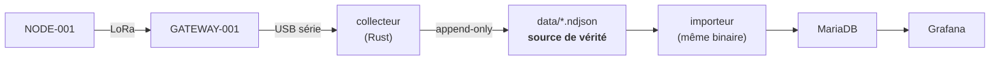

**La question.** Est-ce que l'architecture de données est agréable à exploiter ?

**Critère de sortie.** Une semaine de mesures visible dans Grafana, chaque
mesure correctement rattachée à sa sonde et à sa zone, et l'index reconstructible
depuis l'archive par simple réimport.

**Dépend de.** [O3](/objectifs/o3-calibration/) et
[O4](/objectifs/o4-lien-radio/) · **Débloque.**
[O6](/objectifs/o6-autonomie/)

## La chaîne



Le point important est le **découplage par l'archive** : le nœud ne sait rien
du serveur, le collecteur ne sait rien de SQL, et la base ne sait rien de LoRa.
Chacun peut être remplacé sans toucher aux autres.

L'archive est le point de synchronisation, et elle est la seule pièce dont la
perte serait irréparable.

## Le collecteur

Un binaire Rust — voir [ADR-006](/decisions/#adr-006--collecteur-en-rust) — avec
deux sous-commandes, et des responsabilités volontairement étroites.

`collect` :

1. lire les lignes de `GATEWAY-001` sur le port série ;
2. **horodater** à la réception (le nœud n'a pas d'horloge fiable) ;
3. écrire en append-only dans `data/AAAA-MM/NODE-XXX.ndjson`.

C'est tout. Il ne connaît ni SQL ni MQTT : il sait écrire des lignes.

`import` :

4. relire l'archive et alimenter MariaDB, de façon **idempotente** — rejouer
   toute l'archive ne crée aucun doublon.

La calibration n'est appliquée nulle part : elle est calculée à la lecture par
une vue SQL. Voir [ADR-012](/decisions/#adr-012--larchive-ndjson-est-le-bus-mqtt-sort-du-chemin-principal).

## Le contrôle de fin d'objectif

```console
$ just db-wiring
+----------+---------+------------+-----------+----------+
| node_uid | channel | sensor_uid | zone_uid  | depth_cm |
+----------+---------+------------+-----------+----------+
| NODE-001 | soil-01 | SOIL-A1    | FRAISIERS |       10 |
| NODE-001 | soil-02 | SOIL-A2    | FRAISIERS |       10 |
| NODE-001 | soil-03 | SOIL-A3    | FRAISIERS |       20 |
+----------+---------+------------+-----------+----------+
```

Puis une semaine de mesures lisible à la fois dans Grafana et dans l'archive.

## Le simulateur de nœud

Écrit avant le collecteur, et volontairement : il permet d'éprouver toute la
chaîne serveur **sans matériel**.

```console
$ just sim-serie        # un port série virtuel sur /tmp/jardin-gateway
$ just sim-archive 21   # trois semaines d'historique dans l'archive
```

Le but n'est pas de jouer, c'est de **découpler les pannes**. Si la chaîne
serveur est prouvée avec des données synthétiques, alors le jour où le matériel
arrive, ce qui casse est forcément le matériel ou le firmware — on ne débogue
plus deux inconnues à la fois, une carte neuve dans les mains.

Il reproduit ce qu'on cherchera réellement à observer, plutôt que des nombres au
hasard :

| Phénomène | Pourquoi il compte |
|---|---|
| Assèchement exponentiel, arrosages espacés | la forme des courbes de [O8](/objectifs/o8-exploitation/) |
| **Dispersion inter-sondes** (±8 % sur les bornes sec/saturé) | reproduit la découverte que [O3](/objectifs/o3-calibration/) doit faire |
| Effet de profondeur : la couche à 20 cm réagit moins et plus tard | l'observation qui motive deux profondeurs par zone |
| Oscillation thermique jour/nuit | l'effet qui justifiera une sonde de température |
| Trames perdues, trous dans `seq` | de quoi mesurer un taux de perte |
| Lignes parasites de démarrage (`ets Jul 29 2019…`) | ce qui fait planter un parseur naïf |
| Redémarrages, `seq` qui repart à 0 | à détecter côté collecteur |

Une implémentation **indépendante** du collecteur, en Python : elle ne partage
pas ses hypothèses, ce qui est précisément ce qui rend le test valable.

Les parasites n'existent que sur la liaison série — l'archive, elle, ne contient
que des trames valides. C'est une propriété du collecteur, et le simulateur la
respecte pour ne pas donner un faux sentiment de robustesse à l'importeur.

## Pourquoi une archive en plus de la base

Une ligne JSON par trame, jamais réécrite, dans le format le plus bête possible.
C'est précisément parce qu'il est bête qu'il survivra à tous les changements de
base de données.

La base sert à **regarder et interroger**. L'archive sert à **survivre** : elle
permet de reconstruire l'index de zéro, et de rejouer tout l'historique après un
changement de calibration.

## La stack

Base, visualisation, collecteur et importeur sont décrits dans un seul
`stack/compose.yaml` — voir
[ADR-011](/decisions/#adr-011--la-stack-serveur-est-un-jeu-de-conteneurs).

```console
$ just stack-up            # MariaDB + Grafana
$ just db-wiring           # quelle sonde est branchée où
```

Grafana écoute alors sur `http://localhost:3000`, avec sa source de données déjà
provisionnée. Le collecteur et l'importeur s'ajoutent avec
`just stack-up-collector` quand ils existeront — un profil Compose les tient à
l'écart d'ici là, comme Home Assistant, conservé sous le profil `ha` pour
[O9](/objectifs/o9-irrigation/).

L'intérêt de cette forme est qu'elle ne préjuge pas de la machine : le même
fichier tournera sur le poste aujourd'hui, sur un Raspberry Pi cet hiver. La
question « où héberger » devient un choix d'exploitation, pas d'architecture.

:::caution[Le port série dans un conteneur]
C'est la seule vraie contrainte que la conteneurisation introduit. Le
collecteur a besoin de `devices:` sur la passerelle USB — et surtout d'un **nom
de périphérique stable**, sans quoi `/dev/ttyUSB0` devient `/dev/ttyUSB1` au
premier rebranchement et le conteneur refuse de démarrer. La règle udev est
dans `stack/README.md`.
:::

Conséquence assumée pendant le POC : pas de mesures quand le poste est éteint.

## Questions ouvertes

- L'importeur doit-il tourner en continu (`--follow`) ou par lot périodique ?
- Comment détecter proprement qu'un nœud est muet — un délai fixe, ou un
  multiple de sa période d'émission annoncée ?
- Que fait l'importeur d'une ligne d'archive illisible : il l'ignore et
  poursuit, ou il s'arrête ?
- Faut-il un tableau de bord Grafana provisionné par fichier, ou construit à la
  main puis exporté ?

## Résultats

*À remplir.*
