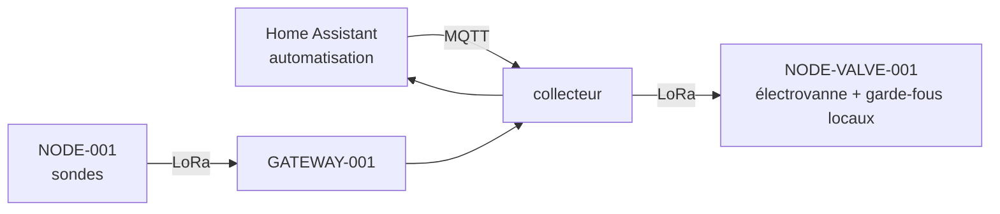

**La question.** Peut-on fermer la boucle sans noyer les fraisiers ni vider la
cuve ?

**Critère de sortie.** Une saison d'arrosage automatique sans intervention
manuelle et sans incident.

**Dépend de.** [O8](/objectifs/o8-exploitation/)

:::note[Objectif lointain]
Cette page fixe des contraintes pour ne pas se fermer de portes en chemin. Elle
sera détaillée quand les objectifs précédents auront produit leurs réponses —
en particulier le seuil, qui n'existe pas encore.
:::

## Ce qui change fondamentalement

Jusqu'ici, une panne signifie perdre des données. À partir d'ici, une panne
signifie **une vanne restée ouverte**. Ce n'est pas une évolution du système,
c'est un changement de nature.

Trois conséquences directes :

- **Sécurité positive.** Une vanne qui perd son alimentation ou sa liaison doit
  se fermer, jamais rester ouverte. Cela se conçoit au niveau matériel, pas
  logiciel.
- **Limites dures.** Une durée maximale d'arrosage et un volume maximal
  quotidien, appliqués **localement** par le nœud actionneur, sans dépendre du
  serveur. Un serveur muet ne doit pas pouvoir provoquer un arrosage infini.
- **Authentification.** [ADR-001](/decisions/#adr-001--lora-point-à-point-plutôt-que-lorawan)
  accepte l'absence de chiffrement parce que les données sont anodines. Une
  commande d'ouverture de vanne ne l'est pas. C'est le moment où cette décision
  doit être révisée.

## L'architecture pressentie

Le choix de Home Assistant à
[ADR-007](/decisions/#adr-007--home-assistant-via-mqtt-discovery) prend ici tout
son sens : la couche d'automatisation existe déjà, avec ses conditions, ses
plages horaires et son interface de reprise en main manuelle.

## Le matériel à étudier le moment venu

- Électrovannes basse tension (typiquement 9 V à impulsion, ou 12 V continu) —
  les modèles à impulsion consomment de l'énergie uniquement au changement
  d'état, ce qui les rend compatibles d'une alimentation solaire.
- Un nœud actionneur, qui a des besoins d'alimentation très différents d'un nœud
  capteur : il doit pouvoir être joint à tout moment, donc il ne peut pas dormir
  de la même façon.
- Mesure de débit, pour vérifier qu'une vanne commandée s'est réellement
  ouverte, et détecter une fuite.
- Niveau de cuve, si l'arrosage se fait sur récupération d'eau de pluie.

## Questions ouvertes

- Vannes à impulsion ou à maintien ?
- Un nœud actionneur par zone, ou un collecteur central de vannes ?
- Comment un nœud actionneur reste-t-il joignable tout en économisant sa
  batterie — fenêtres d'écoute périodiques ?
- Quelle stratégie d'arrosage : durée fixe, ou asservie à la remontée mesurée
  d'humidité ?
- Que fait le système quand la cuve est vide ?
