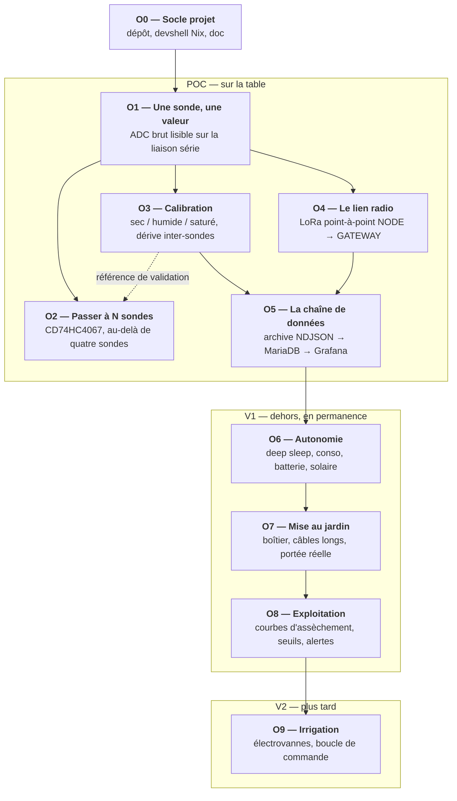
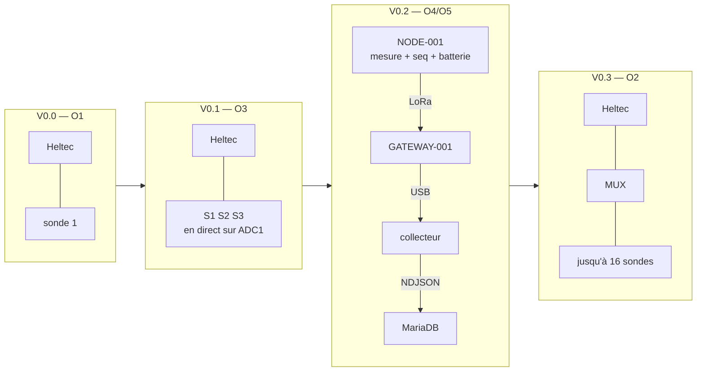

Le projet avance par **objectifs numérotés**. Chacun a un critère de sortie
vérifiable : tant qu'il n'est pas atteint, on n'attaque pas le suivant. Un
objectif n'est pas une liste de tâches, c'est une **question à laquelle on veut
une réponse**.

## Le graphe

Trois choses à lire dans ce graphe :

- **O1 débloque O4 directement.** Le lien radio n'attend pas le multiplexage ni
  la calibration : une seule sonde suffit à valider la portée. Ces deux branches
  peuvent avancer en parallèle si le matériel le permet.
- **O3 ne dépend plus de O2**, et la flèche s'est même inversée en pointillés.
  ADC1 laisse quatre broches libres une fois la batterie et l'alimentation des
  sondes câblées : les trois sondes du POC tiennent en direct. Mesurer leur
  divergence *à travers* un multiplexeur empêcherait d'ailleurs de distinguer
  la dispersion des sondes de celle des canaux. Ces mesures directes sont au
  contraire la **référence contre laquelle O2 se validera** — c'est
  littéralement son critère de sortie.
- **O5 attend O3 *et* O4.** Stocker des mesures non calibrées est possible — et
  c'est même ce qu'on fait, la calibration étant calculée à la lecture. Mais on
  veut que la première série de données archivée soit déjà attribuable et
  interprétable.

## Les objectifs en une ligne

| # | Objectif | Question à laquelle il répond | État |
|---|---|---|---|
| [O0](/objectifs/o0-socle/) | Socle projet | Où vit le code, comment on le construit, où on documente ? | ✅ tenu |
| [O1](/objectifs/o1-une-sonde/) | Une sonde, une valeur | Est-ce qu'une sonde donne une valeur stable et plausible ? | ✅ tenu |
| [O2](/objectifs/o2-multiplexage/) | Passer à N sondes | Est-ce qu'un nœud peut lire plus de quatre sondes sans se mélanger ? | ⏸ multiplexeur non livré |
| [O3](/objectifs/o3-calibration/) | Calibration | Que vaut réellement un nombre d'ADC ? | 🔜 prêt — trois sondes en direct |
| [O4](/objectifs/o4-lien-radio/) | Le lien radio | Est-ce que LoRa porte depuis le fond du jardin ? | 🔜 prêt |
| [O5](/objectifs/o5-chaine-de-donnees/) | La chaîne de données | Est-ce que l'architecture de données est agréable à exploiter ? | ⏸ bloqué |
| [O6](/objectifs/o6-autonomie/) | Autonomie | Combien de temps le nœud tient-il, et sur quelle source ? | ⏸ bloqué |
| [O7](/objectifs/o7-mise-au-jardin/) | Mise au jardin | Est-ce que ça survit dehors, avec 15 m de câble ? | ⏸ bloqué |
| [O8](/objectifs/o8-exploitation/) | Exploitation | Qu'est-ce que le sol raconte, et quand faut-il arroser ? | ⏸ bloqué |
| [O9](/objectifs/o9-irrigation/) | Irrigation | Peut-on fermer la boucle sans noyer les fraisiers ? | ⏸ bloqué |

## Les quatre questions du POC

Les objectifs O1 à O5 existent pour répondre à quatre questions, et à rien
d'autre :

1. Est-ce que les sondes donnent des mesures suffisamment **stables** ?
2. Est-ce qu'un nœud peut lire **plusieurs sondes** ?
3. Est-ce que **LoRa porte** correctement depuis le jardin ?
4. Est-ce que l'**architecture de données** est agréable à exploiter ?

Tout ce qui ne sert pas à répondre à l'une de ces quatre questions est du
travail reporté à la V1.

## La progression du montage

Le nœud grossit par paliers, chacun correspondant à un objectif :

## Ce qui n'est pas dans le graphe

Trois chantiers transverses avancent en continu, sans objectif dédié :

- **la documentation** — chaque objectif atteint produit sa page ;
- **les décisions** — consignées au fil de l'eau dans les
  [ADR](/decisions/), y compris celles qu'on revient dessus ;
- **les mesures elles-mêmes** — dès O1, toute série de mesures est archivée,
  même celles ratées. Une sonde qui dérive est une donnée, pas un échec.
