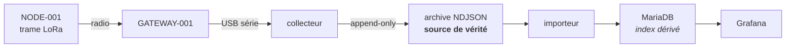
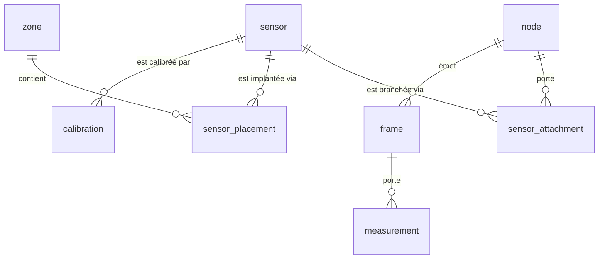

## La chaîne



L'archive est le point de synchronisation. Le collecteur ne connaît ni SQL ni
MQTT : il sait écrire des lignes. L'importeur relit l'archive et alimente la
base — **rejouable de bout en bout**, ce qui rend la base jetable.

## Le tuple canonique

Tout ce qui traverse le système se réduit à :

```text
node_id  sensor_id  timestamp             measurement_type  value   unit
─────────────────────────────────────────────────────────────────────────
NODE-001 soil-01    2026-08-20T12:00:00Z  soil_moisture     1834    raw
NODE-001 soil-02    2026-08-20T12:00:00Z  soil_moisture     1921    raw
NODE-001 battery    2026-08-20T12:00:00Z  voltage           4.87    V
```

Le mot « humidité » n'apparaît **pas** dans le protocole. `soil_moisture` est
une valeur de `measurement_type` parmi d'autres, et son `unit` reste `raw` tant
qu'aucune calibration n'a été appliquée.

## Qui horodate

Le nœud **n'horodate pas**. Il n'a ni RTC ni source de temps fiable après un
deep sleep de plusieurs heures. Il émet un **compteur de séquence** monotone ;
le collecteur horodate à la réception et conserve `seq`, ce qui permet de
détecter a posteriori les paquets perdus et les redémarrages du nœud.

## La trame radio

Lisible, pour le POC :

```json
{
  "node": "NODE-001",
  "seq": 182,
  "battery": 4.87,
  "sensors": { "soil-01": 623, "soil-02": 581, "soil-03": 704 }
}
```

:::note[À réoptimiser plus tard]
LoRa impose un rapport cyclique (1 % en EU868 sur la plupart des sous-bandes) et
un temps d'antenne qui croît avec la taille du paquet. Une trame binaire compacte
deviendra nécessaire quand le nombre de nœuds augmentera — pas avant.
:::

## La distinction qui structure tout le schéma

Trois objets physiques différents, souvent confondus :

| Objet | Ce que c'est |
|---|---|
| **node** | une carte LoRa. Elle émet son identifiant. |
| **sensor** | une sonde. Un objet qu'on tient dans la main, qu'on étiquette, qu'on débranche et rebranche ailleurs. |
| **channel** | la voie sur laquelle une sonde est branchée. `soil-01` **n'est pas une sonde** : c'est une prise. |

`NODE-001/soil-01` et `NODE-002/soil-01` sont deux prises différentes, et la
même sonde peut passer de l'une à l'autre. D'où une **table de liaison datée**
plutôt qu'une clé étrangère directe.



Les tables de faits — `frame` et `measurement` — **ne référencent aucune
sonde**. Une trame ne connaît que des voies. L'attribution à une sonde physique
se fait **à la lecture**, par jointure temporelle.

C'est ce qui permet de déplacer une sonde sans réécrire une seule ligne
d'historique :

```text
SOIL-A3, mesure du 20 août   →  NODE-001 / soil-03 / zone FRAISIERS
SOIL-A3, mesure du 5 sept.   →  NODE-002 / soil-01 / zone POTAGER
```

Les deux restent correctement attribuées, pour toujours.

## Les zones

Une zone est une **décision du jardinier** — une planche, une rangée, un pied
d'arbre — pas un calcul. C'est ce qui correspond à l'action réelle : une
électrovanne arrose une zone, pas un point.

Le polygone est en **repère local, en mètres**. Pas de latitude/longitude : pour
un jardin, la courbure de la Terre n'intervient pas, et un repère métrique rend
les distances directement lisibles.

### Le repère

Un GPS grand public est précis à 3–5 m près. L'allée de fraisiers fait 15 m
sur 0,5 m : le GPS placerait la sonde quelque part dans un cercle englobant
toute l'allée. Un mètre ruban est précis au centimètre.

Le repère est donc **local**, défini par trois choses à figer une fois pour
toutes :

1. **une origine** qui ne bougera pas — un angle de bâtiment, un poteau scellé.
   Pas un pot de fleurs ;
2. **une direction pour l'axe X**, alignée sur quelque chose de physique ;
3. **l'unité : le mètre**, l'axe Y à 90° dans le sens direct.

`POINT(7 3)` se lit alors « 7 m le long de l'axe, 3 m en s'en écartant ».

:::tip[Le nord en haut n'a aucune raison d'être le repère]
C'est une convention de cartographie, pas une contrainte. Aligner l'axe X sur
une limite de terrain ou sur un mur donne un plan où tout est droit, et des
coordonnées qu'on lit sans transposer.
:::

### Le fond de plan

Pas besoin de photo satellite — inutilisable de toute façon si des arbres
masquent une partie du terrain — ni d'une capture d'écran du cadastre, limitée
en zoom. Le cadastre est disponible en **vecteur** via l'API carto de l'IGN :

```console
$ ./tools/plan-parcelle.py --insee <insee> --section <section> --numero <numero> \
      --out docs/src/assets/plan/parcelle.svg
Parcelle du terrain — 19 sommets
  emprise  28.6 x 34.0 m
  surface  855 m2 calcules / 860 m2 au cadastre
  rotation 112.1 deg — le nord pointe dans cette direction
```

L'outil récupère le contour, le convertit en mètres, et **le fait pivoter pour
aligner sa plus longue limite sur l'axe X**. Il vérifie au passage sa propre
conversion en comparant la surface calculée à la contenance cadastrale.

<figure class="plan">
<svg xmlns="http://www.w3.org/2000/svg" viewBox="0 0 484 560"
     role="img" aria-label="Parcelle du terrain">
  <g class="grille"><line class="grid grid--major" x1="0.0" y1="0" x2="0.0" y2="559.6"/><line class="grid" x1="14.0" y1="0" x2="14.0" y2="559.6"/><line class="grid" x1="28.0" y1="0" x2="28.0" y2="559.6"/><line class="grid" x1="42.0" y1="0" x2="42.0" y2="559.6"/><line class="grid" x1="56.0" y1="0" x2="56.0" y2="559.6"/><line class="grid grid--major" x1="70.0" y1="0" x2="70.0" y2="559.6"/><line class="grid" x1="84.0" y1="0" x2="84.0" y2="559.6"/><line class="grid" x1="98.0" y1="0" x2="98.0" y2="559.6"/><line class="grid" x1="112.0" y1="0" x2="112.0" y2="559.6"/><line class="grid" x1="126.0" y1="0" x2="126.0" y2="559.6"/><line class="grid grid--major" x1="140.0" y1="0" x2="140.0" y2="559.6"/><line class="grid" x1="154.0" y1="0" x2="154.0" y2="559.6"/><line class="grid" x1="168.0" y1="0" x2="168.0" y2="559.6"/><line class="grid" x1="182.0" y1="0" x2="182.0" y2="559.6"/><line class="grid" x1="196.0" y1="0" x2="196.0" y2="559.6"/><line class="grid grid--major" x1="210.0" y1="0" x2="210.0" y2="559.6"/><line class="grid" x1="224.0" y1="0" x2="224.0" y2="559.6"/><line class="grid" x1="238.0" y1="0" x2="238.0" y2="559.6"/><line class="grid" x1="252.0" y1="0" x2="252.0" y2="559.6"/><line class="grid" x1="266.0" y1="0" x2="266.0" y2="559.6"/><line class="grid grid--major" x1="280.0" y1="0" x2="280.0" y2="559.6"/><line class="grid" x1="294.0" y1="0" x2="294.0" y2="559.6"/><line class="grid" x1="308.0" y1="0" x2="308.0" y2="559.6"/><line class="grid" x1="322.0" y1="0" x2="322.0" y2="559.6"/><line class="grid" x1="336.0" y1="0" x2="336.0" y2="559.6"/><line class="grid grid--major" x1="350.0" y1="0" x2="350.0" y2="559.6"/><line class="grid" x1="364.0" y1="0" x2="364.0" y2="559.6"/><line class="grid" x1="378.0" y1="0" x2="378.0" y2="559.6"/><line class="grid" x1="392.0" y1="0" x2="392.0" y2="559.6"/><line class="grid" x1="406.0" y1="0" x2="406.0" y2="559.6"/><line class="grid grid--major" x1="420.0" y1="0" x2="420.0" y2="559.6"/><line class="grid" x1="434.0" y1="0" x2="434.0" y2="559.6"/><line class="grid" x1="448.0" y1="0" x2="448.0" y2="559.6"/><line class="grid" x1="462.0" y1="0" x2="462.0" y2="559.6"/><line class="grid" x1="476.0" y1="0" x2="476.0" y2="559.6"/><line class="grid grid--major" x1="0" y1="559.6" x2="484.4" y2="559.6"/><line class="grid" x1="0" y1="545.6" x2="484.4" y2="545.6"/><line class="grid" x1="0" y1="531.6" x2="484.4" y2="531.6"/><line class="grid" x1="0" y1="517.6" x2="484.4" y2="517.6"/><line class="grid" x1="0" y1="503.6" x2="484.4" y2="503.6"/><line class="grid grid--major" x1="0" y1="489.6" x2="484.4" y2="489.6"/><line class="grid" x1="0" y1="475.6" x2="484.4" y2="475.6"/><line class="grid" x1="0" y1="461.6" x2="484.4" y2="461.6"/><line class="grid" x1="0" y1="447.6" x2="484.4" y2="447.6"/><line class="grid" x1="0" y1="433.6" x2="484.4" y2="433.6"/><line class="grid grid--major" x1="0" y1="419.6" x2="484.4" y2="419.6"/><line class="grid" x1="0" y1="405.6" x2="484.4" y2="405.6"/><line class="grid" x1="0" y1="391.6" x2="484.4" y2="391.6"/><line class="grid" x1="0" y1="377.6" x2="484.4" y2="377.6"/><line class="grid" x1="0" y1="363.6" x2="484.4" y2="363.6"/><line class="grid grid--major" x1="0" y1="349.6" x2="484.4" y2="349.6"/><line class="grid" x1="0" y1="335.6" x2="484.4" y2="335.6"/><line class="grid" x1="0" y1="321.6" x2="484.4" y2="321.6"/><line class="grid" x1="0" y1="307.6" x2="484.4" y2="307.6"/><line class="grid" x1="0" y1="293.6" x2="484.4" y2="293.6"/><line class="grid grid--major" x1="0" y1="279.6" x2="484.4" y2="279.6"/><line class="grid" x1="0" y1="265.6" x2="484.4" y2="265.6"/><line class="grid" x1="0" y1="251.6" x2="484.4" y2="251.6"/><line class="grid" x1="0" y1="237.6" x2="484.4" y2="237.6"/><line class="grid" x1="0" y1="223.6" x2="484.4" y2="223.6"/><line class="grid grid--major" x1="0" y1="209.6" x2="484.4" y2="209.6"/><line class="grid" x1="0" y1="195.6" x2="484.4" y2="195.6"/><line class="grid" x1="0" y1="181.6" x2="484.4" y2="181.6"/><line class="grid" x1="0" y1="167.6" x2="484.4" y2="167.6"/><line class="grid" x1="0" y1="153.6" x2="484.4" y2="153.6"/><line class="grid grid--major" x1="0" y1="139.6" x2="484.4" y2="139.6"/><line class="grid" x1="0" y1="125.6" x2="484.4" y2="125.6"/><line class="grid" x1="0" y1="111.6" x2="484.4" y2="111.6"/><line class="grid" x1="0" y1="97.6" x2="484.4" y2="97.6"/><line class="grid" x1="0" y1="83.6" x2="484.4" y2="83.6"/><line class="grid grid--major" x1="0" y1="69.6" x2="484.4" y2="69.6"/><line class="grid" x1="0" y1="55.6" x2="484.4" y2="55.6"/><line class="grid" x1="0" y1="41.6" x2="484.4" y2="41.6"/><line class="grid" x1="0" y1="27.6" x2="484.4" y2="27.6"/><line class="grid" x1="0" y1="13.6" x2="484.4" y2="13.6"/></g>
  <polygon class="parcelle" points="414.5,517.6 347.2,506.2 157.4,472.5 119.8,464.5 111.7,461.9 102.1,457.0 91.6,450.0 82.6,442.3 73.6,431.9 67.2,422.1 61.3,410.5 56.7,396.8 54.3,381.6 52.6,367.4 50.3,297.8 48.7,240.4 42.0,42.0 442.4,42.0 435.7,152.5"/>
  <g class="reperes"><text class="tick" x="42.0" y="555.6" text-anchor="middle">0</text><text class="tick" x="112.0" y="555.6" text-anchor="middle">5</text><text class="tick" x="182.0" y="555.6" text-anchor="middle">10</text><text class="tick" x="252.0" y="555.6" text-anchor="middle">15</text><text class="tick" x="322.0" y="555.6" text-anchor="middle">20</text><text class="tick" x="392.0" y="555.6" text-anchor="middle">25</text><text class="tick" x="6" y="521.6">0</text><text class="tick" x="6" y="451.6">5</text><text class="tick" x="6" y="381.6">10</text><text class="tick" x="6" y="311.6">15</text><text class="tick" x="6" y="241.6">20</text><text class="tick" x="6" y="171.6">25</text><text class="tick" x="6" y="101.6">30</text></g>
  <g class="nord" transform="translate(442,42)">
    <line x1="0" y1="0" x2="20.4" y2="8.3"/>
    <circle cx="0" cy="0" r="2.5"/>
    <text x="30.6" y="16.4" text-anchor="middle">N</text>
  </g>
  <text class="echelle" x="8" y="16">graduations en mètres · repère local</text>
</svg>
<figcaption>Parcelle du terrain, repère local aligné sur la limite la plus longue.
Graduations en mètres, majeures tous les 5 m.</figcaption>
</figure>

:::note[Ce plan est anonyme]
Le SVG ne contient que des **mètres relatifs à un coin du terrain** — aucune
latitude, aucune longitude. Il peut donc être publié sans révéler où se trouve
le jardin. Les paramètres de transformation (origine réelle et rotation) n'ont
pas à être versionnés : le repère local se suffit à lui-même.
:::

:::caution[Ne pas confondre zones et interpolation]
La tentation est d'estimer un champ continu d'humidité entre les sondes, façon
carte météo. Mais le champ **n'est pas continu** : type de sol, exposition,
couvert végétal, pente et tassement font que deux sondes à 5 m peuvent
légitimement diverger sans gradient entre elles. Interpoler y inventerait des
valeurs plausibles et fausses.

L'appartenance à une zone est donc déclarée, pas déduite. La position ne sert
qu'à la carte — une vue `v_placement_anomalies` signale les positions qui
tombent hors de leur zone déclarée, sans rien interdire.
:::

## Les vues

On n'interroge jamais `measurement` directement.

| Vue | Ce qu'elle donne |
|---|---|
| `v_measurement` | chaque mesure, avec la sonde, la profondeur et la zone **en vigueur au moment de la mesure** |
| `v_soil_moisture` | idem, plus la valeur calibrée calculée à la volée |
| `v_current_wiring` | quelle sonde est branchée où, en ce moment |
| `v_placement_anomalies` | les positions incohérentes avec leur zone |

La calibration n'est **jamais écrite** dans les données. La corriger recalcule
tout l'historique, sans migration — c'est la promesse de
[ADR-002](/decisions/#adr-002--on-stocke-la-valeur-adc-brute), tenue par une
vue plutôt que par du code.

## Les garde-fous

SQL ne sait pas exprimer déclarativement « ces intervalles ne se chevauchent
pas ». Or un chevauchement ne produirait aucune erreur : la jointure temporelle
rendrait deux lignes au lieu d'une, et les mesures seraient dupliquées **en
silence**. Des déclencheurs l'interdisent :

| Garde-fou | Effet |
|---|---|
| Deux sondes sur la même voie au même moment | refusé |
| Une sonde branchée à deux endroits au même moment | refusé |
| Deux implantations simultanées pour une sonde | refusé |
| Réimport de la même ligne d'archive | refusé — l'import est idempotent |
| Type de mesure inconnu (faute de frappe) | refusé par clé étrangère |

L'unicité sur `(source_file, source_line)` est ce qui rend le réimport sûr :
rejouer toute l'archive ne crée aucun doublon.

## Persistance

| Quoi | Rôle | Où |
|---|---|---|
| Archive NDJSON | **source de vérité**, append-only, jamais réécrite | `stack/data/`, en clair sur l'hôte |
| MariaDB | index dérivé, requêtable | volume Docker |
| Grafana | visualisation | volume Docker |

L'archive est délibérément **hors volume Docker** : elle doit survivre à un
`docker compose down -v` distrait, et rester sauvegardable avec un simple `cp`.

## Déclarer son matériel

Rien n'est découvert automatiquement : les nœuds, les sondes et leurs liaisons
se déclarent à la main. Un modèle commenté est fourni dans
`stack/mariadb/declarations.example.sql`.

:::tip[La règle de survie]
Le `uid` d'une sonde doit être **écrit sur la sonde**, au marqueur indélébile,
avant de la mettre en terre. Sans étiquetage physique, le jour où deux sondes
divergent, plus rien n'est attribuable.
:::

Et pour déplacer une sonde : ne jamais modifier la ligne existante. On la
**clôt** (`valid_to`) et on en ouvre une nouvelle. Modifier réattribuerait tout
l'historique, rétroactivement et sans le dire.
