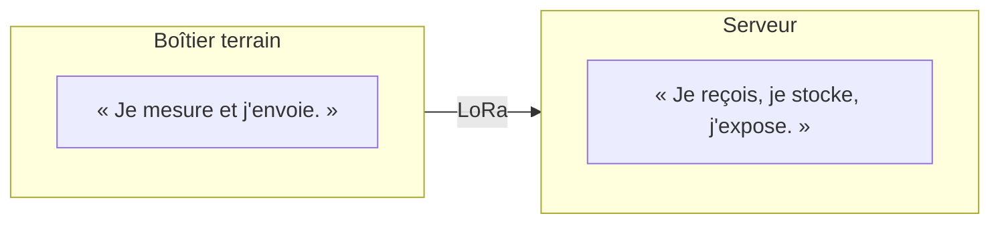

Cinq principes. Ils ne sont pas négociables au coup par coup : si l'un d'eux
gêne, on le remet en cause explicitement dans une
[décision](/decisions/), on ne le contourne pas en silence.

## 1. Le nœud mesure et envoie. Rien d'autre.



Pas de base de données dans le boîtier solaire. Pas de logique métier, pas de
seuil d'arrosage, pas d'horloge de référence embarquée. Le nœud sait produire
une phrase du type :

```text
NODE-001 vient de mesurer S01=623, S02=581…
```

et c'est tout. Cette contrainte est ce qui rend les nœuds interchangeables.

## 2. Le serveur ignore ce qu'il y a en face

Le modèle de données ne mentionne ni ESP32, ni ADC, ni sonde capacitive. Il
manipule des mesures génériques :

```text
node_id / sensor_id / timestamp / measurement_type / value / unit
```

Un nœud peut donc être :

```text
NODE-001                   NODE-017
 ├── soil-01                ├── soil-01
 ├── soil-02                ├── soil-02
 ├── soil-03                ├── air-temperature
 └── battery                ├── humidity
                            └── battery
```

sans qu'une seule ligne de serveur change. Voir
[le modèle de données](/projet/modele-de-donnees/).

## 3. On stocke le brut, on calcule le dérivé

Une sonde capacitive produit une grandeur électrique, pas une humidité. La
conversion dépend du type de sol, de sa composition, de sa salinité, de la
profondeur, du modèle de sonde et de la façon dont elle est plantée.

```text
raw = 1847              ✅ stocké
soil_moisture = 62 %    ❌ jamais stocké tel quel
```

La calibration est une **couche au-dessus**, rejouable rétroactivement sur tout
l'historique le jour où on la corrige. Voir
[ADR-002](/decisions/#adr-002--on-stocke-la-valeur-adc-brute).

## 4. La sonde est séparée de l'électronique

```text
           câble
[SONDE] ───────────┐
[SONDE] ───────────┤
[SONDE] ───────────┤
                   ▼
              [NODE-001]
                   │
                  LoRa
```

Un nœud au milieu, plusieurs sondes réparties. Pour l'allée de 15 m :

```text
0m        5m        10m       15m
│---------│----------│---------│
    S1          S2        S3
             │
          NODE-001
```

Une seule batterie, un seul panneau, un seul point de panne, une seule
maintenance. L'inconvénient — tirer des câbles — est assumé : c'est justement
ce que [O7](/objectifs/o7-mise-au-jardin/) doit mettre à l'épreuve.

## 5. On ne résout pas un problème avant de l'avoir rencontré

Une sonde analogique au bout de 15 m de câble, ce n'est pas la même chose
qu'une sonde à 30 cm du microcontrôleur. On peut avoir du bruit, de la chute de
tension, des interférences, des écarts entre sondes, des soucis d'impédance.

La tentation est de blinder le montage tout de suite. Le choix inverse est
assumé : **le POC sert à découvrir lesquels de ces problèmes existent
réellement**, avec des mesures à l'appui. Les corriger avant de les avoir vus,
c'est concevoir contre des fantômes.

Corollaire opérationnel : chaque objectif produit des **mesures archivées**,
même quand elles sont mauvaises.
